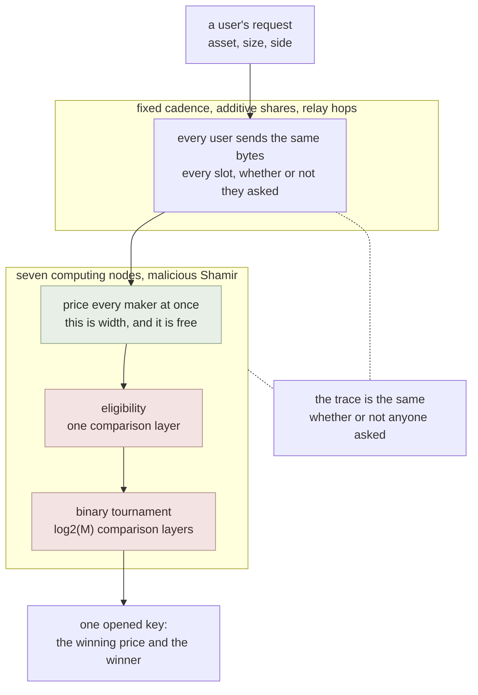
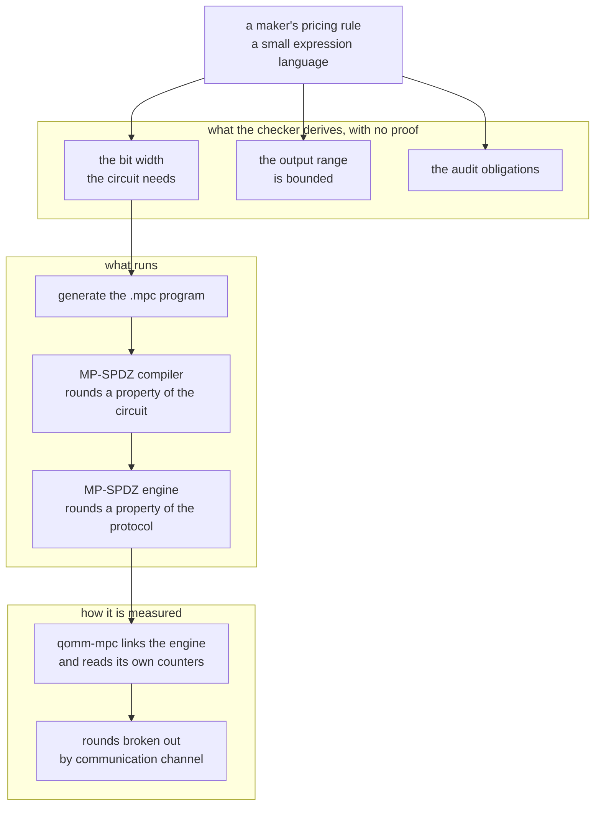

# qomm

**QOMM** is the implementation of *Oblivious Market Making*. It settles through [zkpi](https://github.com/shukob/zkpi) and [defmi](https://github.com/shukob/defmi), a *zero-knowledge payment instruction* and a *decentralized financial market infrastructure*.

Oblivious market making: quote without disclosing the request, the pricing rule, or the market.

## Deployment target

QOMM is chain-independent until settlement. The product path emits zkPI instructions to DeFMI, whose current execution target is the dedicated non-EVM Avalanche L1 in the [defmi repository](https://github.com/shukob/defmi).


## What it does



## What it is made of



Generated from one shared research tree, which is why the layout is regular
across the three repositories. This repository is nevertheless self-contained:
its tests, locks, measurements and source do not require the private working
tree.

## What is here

Rust:

- `rust/qomm-dsl`
- `rust/qomm-law`
- `rust/qomm-proofs`
- `rust/qomm-sim`
- `rust/qomm-mpc`

Python:

- `qomm_sim/`
- `qomm_dsl/`
- `qomm_audit/`
- `qomm_transport/`
- `qomm_demo/`
- `qomm_identity/`
- `mp_spdz/`
- `zk/`

`artifacts/` holds the measurements the numbers in the paper are taken from, as
the runners wrote them. Each carries the host it ran on as a label (`host-a`,
`host-b`, `host-c`) rather than a machine name, and the mapping back is not
published --- it names people's machines. `scripts/hosts.py` reads it from a
local file when there is one and labels nothing when there is not, which is what
this copy does.

## Documents

- [`AUDIT.md`](AUDIT.md) --- what the audit machinery checks, what it catches, and what it costs
- [`DEPLOYMENT.md`](DEPLOYMENT.md) --- what every measurement implies for what to deploy where
- [`BINDING.md`](BINDING.md) --- the one gap between what was computed and what was committed, the two ways to close it, and what each one costs
- [`REGULATION.md`](REGULATION.md) --- which accounts and which statutes a live deployment touches, in Japan and in four other jurisdictions
- [`POSITION.md`](POSITION.md) --- what is new here and what is not, stated line by line against the nearest prior work
- [`ACCOUNTABILITY.md`](ACCOUNTABILITY.md) --- what happens when a node misbehaves: the five rungs from abort to guaranteed output delivery, and which one each mechanism here reaches
- [`DEMO.md`](DEMO.md) --- a demonstration a room can operate one seat each, and what is real in it
- [`REVIEW.md`](REVIEW.md) --- what two rounds of review found, including what was checked and found sound

## Depends on

- [zkpi](https://github.com/shukob/zkpi)

Cargo and Python both resolve these repositories from the checked-in lock files.

## Running it

```
cargo test --workspace --all-targets --all-features --release  # in rust/
uv sync --frozen
uv run --frozen pytest tests/                               # repository root
```

## Measurements

Every reported number has an artifact and a command that produces it. Where a
measurement needs something not shipped here --- MP-SPDZ, a second host, a market
data feed --- the command says so and fails rather than substituting a default.

## License

MIT. See `LICENSE`.
