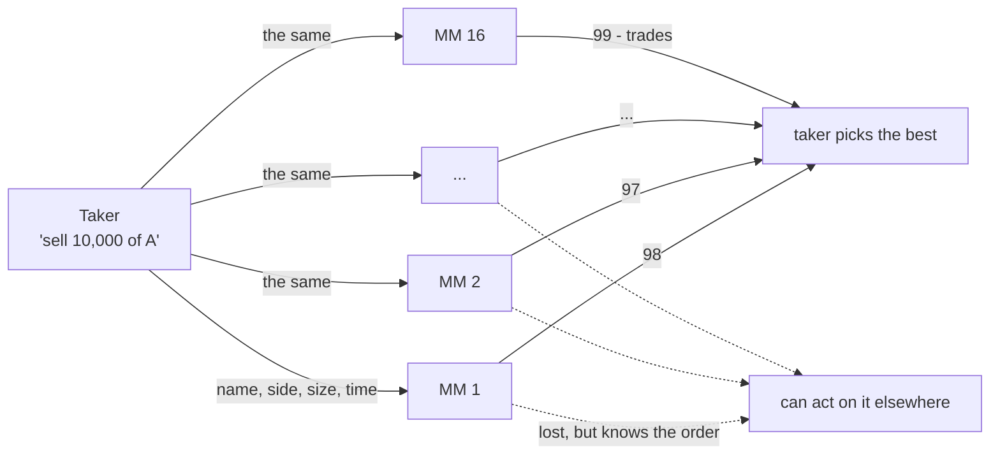
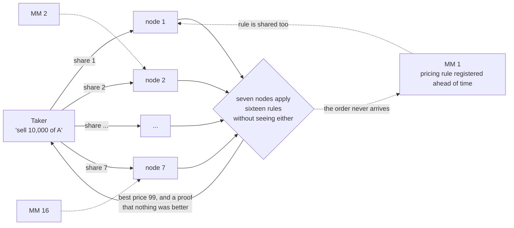

# Which accounts, and under which law

A map of the accounts and the statutes a live deployment touches, along one
path: **a taker sends a request for quote, market makers price it, and
settlement moves the two legs.**

**This is not legal advice.** It is a map drawn so that the engineering does not
walk into a structural problem late. Whether any of it is lawful depends on who
operates it and where, and that question belongs to counsel. What this document
can do is narrow the search: it says which questions have to be asked, which
answers are already fixed by statute, and which jurisdictions have already
legislated the thing the architecture needs.

Japan is treated first because that is where the accounts were worked out in
detail; the comparative section then asks where the same architecture fits
better, and why.

---

## The picture

Concretely: **an investor wants to sell ten thousand shares and asks sixteen
market makers for a price.**

### Today

**The fifteen who lost still know who wanted what, which way, how much, and
when.** That is not an implementation defect. It is what asking for a price
costs, in any system where asking means telling.

### Proposed

No node sees a whole order; one node holds only a share. No market maker sees
the order at all; a rule they registered is applied to it. The taker gets a
price **and a proof that it was the best of the sixteen.**

The fifteen who lost take away nothing.

---

## 0. Who this is for

**The system is wholesale by construction, and the drafts should have said so.**
Participants are authenticated as legal entities by a KYB issuer; there is no
point in the design where a natural person is onboarded. The intended users are
institutional investors, corporate treasuries and proprietary trading firms.

Retail is deliberately out of scope. Adding it changes the requirements
qualitatively rather than quantitatively --- suitability, pre-contract
disclosure, advertising rules, investor compensation schemes --- and the
sharpest of those is not a disclosure rule at all but key management. An
institution answers "who holds the signing key" with an HSM and a quorum. A
private individual cannot, so custody moves to an intermediary, and **part of
the confidentiality the protocol exists to provide is handed back to an
operator.** That trade is worth making explicitly or not at all.

**Confidential computation is not an investor-protection argument.** What it
protects is the content of an order. Suitability, disclosure and segregation
live in a different layer and are untouched by it.

---

## 1. What the architecture needs from a legal system

Three requirements fall out of the design, and they are what the comparison in
section 3 scores against.

**N1 --- a venue category that permits a system to evaluate orders it does not
publish.** QOMM is a request-for-quote system that by construction never
discloses a quote pre-trade. It needs a regime where that is permitted as a
matter of rule, not tolerated as a matter of practice.

**N2 --- a legal record that the settlement ledger can be.** DeFMI either
mirrors an authoritative register kept elsewhere, or it *is* the register. The
second requires a statute saying that an entry in a ledger constitutes title.
Whether such a statute exists is the single largest difference between
jurisdictions.

**N3 --- a cash leg with real finality that a distributed ledger can reach.**
Without it, delivery versus payment is atomic on one side only.

Two further costs are independent of all three, and section 4 returns to them:
the seven node operators are seven third parties whose availability the venue
still owns, and no supervisor anywhere accepts "we are unable to show you."

---

## 2. Japan

### 2.1 The taker's accounts

| Account | Held with | Basis | What it records |
|---|---|---|---|
| Securities account | Type I financial instruments business operator | FIEA art. 29 (registration) | Executions, cash balances, positions |
| Book-entry account | The same firm, acting as an **account management institution** | Book-Entry Transfer Act | Quantity per issue, pledges and trust notations, transfer history |
| Cash | Client money at the broker, or a bank deposit | FIEA art. 43-2 (segregation) / Banking Act | Balance |

**The entry in the book-entry register is what the right consists of.** This is
not a recording of a right held elsewhere, and it is the fact that decides
section 2.5.

The hierarchy runs `JASDEC -> direct account management institution -> indirect
account management institution -> investor`. JASDEC sees only each institution's
proprietary and customer accounts, never the composition of the customer
account; that composition surfaces only in the shareholder notification at a
record date.

QOMM identifies participants by a per-venue handle, which is a different
identifier from the book-entry account holder, and has to map onto one of two
things:

- **(a) onto an existing account.** The account management institution holds the
  correspondence between handle and book-entry account; QOMM sees only handles.
  Easy to reconcile with the existing regime, at the cost of one party holding a
  table that deanonymises everything.
- **(b) as the account holder itself.** This means leaving the book-entry regime
  for the **electronically recorded transferable rights** rail under FIEA art.
  2(3). A handle can then be the subject of the record --- but a single issue
  cannot sit on both rails at once.

### 2.2 What business QOMM is in

This is the most ambiguous question and the most consequential. **Collecting
quotes from several market makers and returning the best is not one regulated
activity; which one it is turns on where the contract of sale forms.**

| Design | Activity | Authorisation |
|---|---|---|
| Returns a price; the trade forms bilaterally between taker and one MM | **Brokerage or intermediation** in securities | Type I registration (art. 29) |
| QOMM itself brings the trade about | **Proprietary trading system (PTS)** | **Authorisation** by the Prime Minister (art. 30) |
| An MM deals as principal and QOMM is that MM's tooling | The MM's **own-account dealing** | Type I on the MM's side |

Registration and authorisation are not the same weight. Describing QOMM as "a
device that returns the best price" points at the first row, but seven nodes
selecting a minimum and returning it can equally be read as execution. **The
answer is not settled by how the system is described. It is settled by who
contracts with whom.**

There is a domestic precedent. **START**, operated by Osaka Digital Exchange,
took a PTS authorisation under FIEA art. 30(1) and opened on 25 December 2023 as
Japan's first secondary market for security tokens. If QOMM stands where START
stands, it needs what START needed.

### 2.3 Best execution

FIEA art. 40-2 requires a written best-execution policy, its publication, and
execution consistent with it.

**QOMM fits here better than it fits anywhere else in the statute.** Evaluating
sixteen quotes on identical terms and returning the minimum is what a
best-execution policy describes in prose; the audit machinery then proves, in a
form anyone can check, that the returned price really was the minimum under the
registered rules.

Best execution is not price alone --- speed, likelihood of execution and size
all count --- so a policy has to say plainly that QOMM optimises price. Section
3.6 shows why this section generalises further than the rest of the Japanese
analysis.

### 2.4 The market maker's accounts, and what rule registration really is

| Account | Held with | Basis |
|---|---|---|
| Proprietary book-entry account | Account management institution or JASDEC | Book-Entry Transfer Act; legally separate from customer accounts |
| Clearing participant account | JSCC, where a CCP is used | FIEA (clearing organisations) |
| Cash settlement account | BOJ current account, or a settlement bank | Bank of Japan Act / Banking Act |

In QOMM a market maker registers a pricing rule ahead of time --- two-sided
prices by size band, inventory caps, an expiry --- and the nodes apply it. In
operational terms this is **a delegation of pricing authority**, and it carries
what any such delegation carries: an internal approval trail for each rule, an
effective-from time, consistency with limit management, an authority and a route
to pull a rule, and retained change history.

The `policy digest` and `state proof` the protocol emits are usable as evidence
for all of that. **Evidence that controls were exercised is not the same thing
as controls existing.** The former is material for the latter.

### 2.5 DeFMI cannot be the book-entry register

**Not under the Book-Entry Transfer Act.** The right is the entry in the
register kept by the transfer institution and the account management
institutions --- not a commitment ledger DeFMI keeps alongside it. Two options
remain:

**(a) Run as a mirror, a control plane.** DeFMI reflects the register, checks
rules, state and receipts, and is never the authoritative ledger. This is the
position the regulated-finance draft takes. It sits on top of the existing
regime without disturbing CCP or CSD --- at the price of double bookkeeping, in
which the register is always right when the two disagree.

**(b) Issue on the electronically recorded rights rail.** Under FIEA art. 2(3)
the instrument leaves the book-entry regime, and DeFMI's record can then be the
record. No double bookkeeping, and DvP closes inside DeFMI --- but only for
security tokens, never for listed equities, and never alongside (a) for the same
issue.

**Present (a) as the default and (b) as a future that works for security tokens.**

Note also what DeFMI is *not*. Decomposed, the existing chain is execution,
confirmation, **clearing** (JSCC: novation, netting, margin, settlement
guarantee), securities delivery (JASDEC) and cash delivery (BOJ-NET). DeFMI
touches delivery. **Exchanging two parties' tokens simultaneously does not
reproduce a CCP** --- there is no novation and no default waterfall --- and
saying otherwise would be a claim the code does not support.

### 2.6 The cash leg

| Instrument | Statute | Finality |
|---|---|---|
| BOJ current account (BOJ-NET) | Bank of Japan Act | Central bank money, RTGS |
| Bank deposit (Zengin) | Banking Act / Payment Services Act | Commercial bank money |
| Stablecoin (electronic payment instrument) | Payment Services Act | Reserve requirements depend on issuer type: bank, funds transfer, trust |

**zkPI instructs a payment without revealing the amount; it does not choose what
the payment is made in.** The gap between central bank money and commercial bank
money is a difference in the strength of finality, and it is settled outside the
protocol.

---

## 3. Where else this fits, and better

### 3.1 The comparison

Scored against N1, N2 and N3 from section 1.

| | N1: non-disclosing venue | N2: ledger as title | N3: cash leg | Already exists |
|---|---|---|---|---|
| **Japan** | PTS authorisation, art. 30 --- heavy | **No** on the book-entry rail; yes on the art. 2(3) rail, security tokens only | BOJ-NET; PSA electronic payment instruments | START (ODX), ST PTS since Dec 2023 |
| **Switzerland** | **DLT trading facility licence** --- purpose-built; one licence covers trading, settlement and custody | **Yes --- CO arts. 973d-973i, in force 1 Feb 2021. The register entry is the right.** | SDX plus SNB wholesale CBDC | BX Digital, first DLT trading facility licence, 12 Mar 2025; SDX exchange and CSD since Sep 2021; six digital bonds, over CHF 750m, settled in wCBDC |
| **EU** | MTF/OTF, plus **DLT MTF and DLT TSS** under Reg. 2022/858 --- the TSS is trading and settlement in one entity | Member state by member state: Germany's eWpG crypto securities register constitutes the security; registrar licensed by BaFin | T2; MiCA e-money tokens; ECB DLT settlement work | **Three** authorised DLT infrastructures as at 31 May 2025 |
| **UK** | MTF/OTF, plus the **Digital Securities Sandbox** | Within the sandbox perimeter, yes --- the DSS modifies the settlement and uncertificated-securities rules | **Strongest available: the BoE omnibus account puts central bank money under a DLT payment system** | DSS open since 30 Sep 2024, gates 1-3, BoE-set limits; Fnality live in sterling since Dec 2023 with settlement finality designation |
| **Singapore** | **Recognised Market Operator** --- materially lighter than an exchange licence, and the institutional-only tier is exactly wholesale | **Weakest** --- no equivalent statute making the ledger entry the right; relies on trust, custody and contract | MAS stablecoin framework; Project Orchid, Global Layer One | **Project Guardian** --- real institutions, real trades, the regulator in the room |

### 3.2 Switzerland --- the only place N2 is simply true

The DLT Act inserted ledger-based securities into the Code of Obligations, arts.
973d-973i, in force 1 February 2021. **The entry in the register is the security.**
That is precisely option (b) from section 2.5, available generally rather than
for a carve-out asset class, and it is the one legal fact that changes DeFMI
from a mirror into a ledger.

The venue side matches: a DLT trading facility licence covers trading and
post-trade in one authorisation, which is what QOMM plus DeFMI actually is. It
is not theoretical --- BX Digital took the first such licence on 12 March 2025,
and SDX has held exchange and CSD licences since September 2021 and has settled
six digital bonds totalling more than CHF 750m in wholesale central bank money
under Project Helvetia III, which the SNB has extended.

The cost is reach: a small home market, and no passport into the EU.

### 3.3 EU --- right on paper, unused in practice

Regulation (EU) 2022/858 created the DLT MTF, the DLT SS and the **DLT TSS**,
and the TSS is a single entity running trading and settlement with exemptions
from the rules that would otherwise force them apart. On paper that is the
QOMM-plus-DeFMI shape, legislated.

In practice **three** infrastructures had been authorised as at 31 May 2025.
ESMA's June 2025 review is positive about what the regime provoked and candid
about the uptake, and the volume caps and cash-settlement constraints are the
usual explanations. Treat the regime as available but not yet load-bearing, and
expect its terms to move.

For N2 the answer is national. Germany's Electronic Securities Act makes an
entry in a crypto securities register constitute the security, with the
registrar itself a BaFin-authorised activity --- which in practice means using
an authorised registrar rather than becoming one.

### 3.4 UK --- the best cash leg anywhere

The **Digital Securities Sandbox**, run jointly by the Bank of England and the
FCA, opened on 30 September 2024. Entrants pass gate 1 for non-live testing,
gate 2 for live activity and gate 3 to scale, with the Bank setting aggregate
limits per asset class. Inside that perimeter the settlement and
uncertificated-securities rules are modified, so **N2 is satisfied for the
sandbox perimeter and for its duration** --- weaker than a Swiss statute,
because it is a perimeter rather than a general rule, but wider in scope than
Japan's security-token carve-out and available for several years.

N3 is where the UK is strongest anywhere. The **omnibus account** lets a
recognised payment system operator pool participant funds at the Bank of England
and fund balances on its own platform with central bank money. Fnality was the
first holder, has been live in sterling since December 2023, and the sterling
system carries settlement finality designation. **This is the only production
route by which a DLT settlement system reaches central bank money finality**,
and it is exactly the gap section 2.6 leaves open.

### 3.5 Singapore --- the fastest route to counterparties

The Recognised Market Operator regime is genuinely lighter than an exchange
authorisation, and MAS has proposed splitting it into tiers of which the
institutional-only tier is a direct fit for a wholesale venue; base capital
there is an order of magnitude below an Approved Exchange.

N2 is the weak point. Singapore has no Swiss- or German-style statute making a
ledger entry the right, so DeFMI stays a mirror and title runs through custody
and contract.

Against that, **Project Guardian supplies the resource no statute can**:
institutions that will actually trade. A protocol whose entire premise is that
sixteen market makers quote without seeing the order cannot be evaluated with
fewer than sixteen willing market makers, and finding them is harder than
finding a favourable statute.

### 3.6 The finding that changes what to build

The 2024 MiFIR review narrowed article 8 so that pre-trade publication of quotes
for bonds, structured finance products and emission allowances attaches only to
**central limit order books and periodic auction systems**, and removed the
size-specific-to-the-instrument waiver for request-for-quote systems as no
longer needed.

Read together: **in EU non-equity markets, an RFQ system is not required to
publish quotes before the trade.** The confidentiality QOMM provides is not
being tolerated at the edge of a waiver --- it is the baseline the legislator
chose. Equities are the reverse: articles 3 and 4 impose pre-trade transparency
on venues subject to enumerated waivers, so an equity RFQ system has to live
inside a named waiver.

The design consequence is direct. **QOMM's natural home in the EU and the UK is
non-equity --- bonds and derivatives --- not equities**, and that is also where
RFQ is how the market already trades. It is worth noticing that this cuts
against Japan, where the friction lives on the equity book-entry rail.

There is a second consequence for best execution. The obligation to publish
RTS 28 execution-quality reports was **deleted** by the MiFID II review
directive, the recital saying the reports are hardly read and do not permit
meaningful comparison; the FCA had already removed them in December 2021, and
RTS 27 was deprioritised and then dropped. The duty in article 27 survives; the
reporting built to evidence it did not, because nobody could verify it.

**QOMM produces the verifiable version of exactly the thing that was abolished
for being unverifiable.** That is the strongest regulatory argument the system
has, and it does not depend on any of the DLT regimes above.

---

## 4. What moving jurisdiction does not fix

**Selective disclosure.** No supervisor in any of these jurisdictions accepts an
inability to produce transaction records. Every regime here assumes records can
be produced on demand. If the only way to open a trade is the participant's own
secret key, the system is unusable in production regardless of where it is
authorised. **This is the largest unimplemented gap in the stack and it is
jurisdiction-independent.**

**Seven node operators are seven third parties.** Under DORA in the EU, the
critical-third-parties regime in the UK, MAS outsourcing and technology risk
guidance in Singapore, and outsourcing supervision under the FIEA in Japan, the
venue owns the availability and resilience of parties it does not control. This
is a cost of the architecture, not of any one country --- and it interacts with
a trade-off already recorded in `DEPLOYMENT.md`, where the latency measurements
push the seven nodes into one metro while the T=2 assumption wants them apart.
Regulation adds a third force: node operators in different jurisdictions are
what makes independence a fact rather than an assertion, and they are also seven
separate outsourcing files.

**Clearing.** Nothing above turns simultaneous two-party exchange into a central
counterparty. Wherever it is authorised, DeFMI settles; it does not clear.

**Lawfulness.** Choosing a jurisdiction changes which of the two options in
section 2.5 is available. It does not make the architecture compliant, and no
part of this document should be read as saying it does.

---

## 5. Where the nodes sit, and whose law they sit under

Two measurements decide the shape here, so they come first.

**Geographic independence has one price, not a sliding scale.** At 120 ms one
way --- Tokyo to Zurich --- a single distant node takes one quote from 0.517 s
to 23.0 s, and costs 86% of what moving all seven costs
(`DEPLOYMENT.md` section 0.1). Six nodes at home and one abroad is not a partial
purchase of independence; it is the whole bill. So the committee is either
inside one region or spread across several, and there is nothing in between.

**And the spread committee is affordable, which is the part that is easy to get
wrong.** The number that matters is not the 26 s but whether the price moved in
them. Measured against real fills, 26 s of drift is **1.01x** the dispersion the
same market already shows inside a single block --- a quote that took 26 s is
not distinguishable from an instantaneous one, because the price was never that
precisely defined (`DEPLOYMENT.md` section 0.2, on crypto, which is the harshest
case; instruments that move less make it cheaper still).

So jurisdictional independence for T=2 is **available and purchasable**, not
foreclosed by physics. Continuous quoting is not foreclosed either: a taker on a
26 s stream acts on a price 13 s old on average and waits for nothing, where a
taker on a 26 s request-for-quote waits the full 26 s for a price just as old.
What a slow stream costs falls on the maker, who widens by about the drift.

**And the drift need not be paid at all.** The quote is affine in the reference
price and the winner does not depend on it, so a slow committee can run against
the reference that was current when it started and have the revealed price
corrected afterwards for free (`DEPLOYMENT.md` section 0.4). That is a property
the design has rather than one the implementation currently uses, but it is the
difference between a wide-area deployment being a compromise and being a
configuration.

The choice is therefore per instrument, and the two settings do not defend
against the same adversary, so both should be written down rather than one being
assumed.

### 5.1 Two tiers, two adversaries

**A regional committee defends against market participants.** Seven operators
supervised by one authority still defeat a competing market maker, a curious
node operator and two colluding nodes --- which is the whole of what the design
is for. What it does not defeat is the jurisdiction itself: one legal order can
reach all seven.

**It does not have to, and that is what makes the fast setting defensible.** The
authority that licenses the venue can already compel the records through
selective disclosure (section 4). **There is nothing to gain by hiding from the
regulator that authorised you**, and the sixteen market makers, against whom T=2
is exactly as strong as it ever was, are the adversary the confidentiality
exists for.

**A committee spread across legal orders buys the stronger property outright**,
and section 5 says what it costs: 26 s, and no continuous quoting. Where the
instrument is illiquid --- wide spread, thin book, large size --- that is both
where a leaked order does the most damage and where the 26 s is cheapest, so the
economics and the physics ask for the same thing. Where the instrument is liquid
and tight, they do not, and the regional committee with its supervisor is the
setting that fits.

**Crossing regions is a settlement problem.** Two ledgers that share no state
settle through an adaptor signature and a deadline, whose cryptography costs
0.06 ms and whose exposure is the two ledgers' finality (`DEFMI.md` section 6).
That is not round-bound, so it crosses an ocean where seventy rounds cannot.
Its adversary is different again: no single legal order holding both halves.

A market maker quoting an instrument outside its own region does not need a
committee spanning both. Policy registration and quote computation are already
separate, so **the rule crosses once, offline, where latency does not matter**,
and quotes are computed locally against it from then on.

### 5.2 Route by instrument, because the register decides the law

If the counterparties decide which committee handles a request, the routing
leaks: taking the cross-region path says the trade is cross-border. If the
**instrument** decides, nothing leaks --- and the instrument is already what
fixes the applicable register under N2. A Swiss ledger-based security prices on
the Swiss committee and settles on the Swiss ledger whoever is asking.

**The legal answer and the privacy answer are the same answer**, which is rare
enough to be worth taking.

It also makes section 8's table mean something. A slot receipt signed by seven
nodes under one legal order is evidence in that legal order. Signed across five,
it carries five different evidentiary weights and there is no forum in which all
of it counts at once. Putting the committee where settlement happens is what
makes the audit trail admissible where it is needed.

### 5.3 What this costs, and what it does not

**The cost to name.** A market maker quoting a Japanese instrument accepts that
a committee under Japanese supervision holds shares of its pricing rule. No
single node learns the rule; the set is reachable by one authority. **This is
the constraint that will bound adoption in practice**, ahead of any statute in
section 3.

**What it does not cost is operators.** One operator running a node in several
regional committees is still one of seven in each, so independence within a
committee is untouched. Seven to ten operators globally suffice; seven per
region are not needed. The rule to hold is narrower: **a cross-region
arrangement must not draw its operators from any single regional committee.**

### 5.4 On a pure crypto rail the argument inverts

Read as a crypto system rather than under the statutes above, the settlement
side gets easier and the compute side gets harder.

Easier: N2 is free. The chain is the record because no competing register
exists, so the settlement layer is authoritative rather than a mirror --- the
one thing only Switzerland legislates. And with both legs on one ledger, DvP is
available at all, which across two ledgers it is not. What that costs is
measured: a single transaction has no exposure window but **is** the link
between the legs, while an adaptor keeps the legs unrelated for one block and
3.4% more verification (`DEFMI.md` section 6.1).

Harder, and this is the part that gets skipped. **The chain gives the record
without the enforcement.** A Swiss ledger entry is the right and a court will
enforce it; a chain entry is the record and nothing off-chain must honour it.
The security-token statutes of section 3 exist precisely to buy that missing
half, which makes the crypto reading not an alternative to the legal one but
the same architecture with the enforcement layer removed. The same distinction
runs through the cash leg: **finality of the transfer is not finality of the
claim** --- a stablecoin transfer is final on the ledger while the claim stays
with its issuer, so section 2.6's ordering survives tokenisation unchanged.

And the fast half of section 5.1 does not carry over. With no authorising
supervisor there is no lawful-access channel substituting for geographic spread,
so a regional committee's T=2 falls back on organisational independence alone
--- on the rail where an adversary funded to extract value from order flow is
most plainly present. **The spread committee is the answer here rather than a
luxury**, and the staleness measurement that prices it was itself taken on this
rail, so the 26 s is known to be affordable in exactly the market that needs
it. The routing argument fails too:
one metro reaches any chain, so the committee boundary stops coinciding with the
settlement boundary, and what decides the committee becomes an operator rather
than a register.

---

## 6. Where to go, and in what order

Not one country --- a sequence, because the three needs peak in different places.

1. **To demonstrate the whole path with title actually moving: Switzerland.**
   The only jurisdiction where the ledger entry is the right as a general rule,
   the venue licence covers trading and settlement together, and wholesale
   central bank money is in production for the cash leg.
2. **To find counterparties: Singapore, via Project Guardian.** Sixteen willing
   market makers are scarcer than a favourable statute.
3. **To reach volume: EU and UK non-equity RFQ.** The 2024 MiFIR review has made
   this the most permissive place in the world for a request-for-quote system
   that does not publish, with the DSS as the settlement route and the Bank of
   England omnibus account as the cash leg.
4. **Japan: the security-token rail works; the book-entry rail does not.** For
   security tokens, art. 2(3) plus a PTS authorisation is a real path with a
   precedent in START. For listed equities the Book-Entry Transfer Act settles
   the question against option (b), and DeFMI stays a mirror.

---

## 7. Who is responsible for what

| Party | Secrets held | Operational requirement | Evidence produced | Owns on failure |
|---|---|---|---|---|
| **Taker** (institution) | Authentication key, handle seed, commitment openings | Key custody under HSM and quorum, recovery, revocation on staff departure | Order receipts, settlement package | Declaring key compromise, approving trades |
| **Market maker** | Pricing rules, inventory state | Internal approval of rule registration, limit management, kill switch | Policy digest, state proof | Rule updates, risk stop |
| **Computing node operator** (seven) | Key shares, signature shares | HSM, separation by legal entity and jurisdiction, key ceremony, availability | Signed slot receipts | Node outage, incident reporting |
| **Venue / KYB issuer** | Participant register, credential validity | KYB, revocation, management of the MM set | Registry digest, revocation log | Suspension, supervisory response |
| **Settlement operator** | Commitment ledger, nullifiers | State management, recovery, reconciliation against the CSD | State root, settlement proof | Finality, reconciliation |
| **Account management institution** | Handle-to-account correspondence | Segregation, composition of the customer account | The book-entry register | Accuracy of the record of title |

---

## 8. Which evidence discharges which obligation

| What the protocol emits | What it is good for | What it is not |
|---|---|---|
| Slot receipt (signed, carrying time, market, expiry) | Record of the moment of execution; proof of a node's inaction or double signing | Identifying who placed the order |
| Quote validity proof | **Evidence of best execution** --- that the returned price really was the minimum | Execution quality other than price: speed, certainty |
| Pricing rule audit | Evidence for the MM's internal control | The control functioning |
| Inventory state chain | Detection of a second set of books, or retroactive edits | Whether the inventory exists off-ledger |
| Settlement state root and conservation | Completion of delivery, prevention of double settlement | **That only an authorised issuer issued** --- true only once an issuer signature is in the statement |
| Selective disclosure (`rust/qomm-defmi/src/viewing.rs`, `rust/qomm-transport/src/binding.rs`) | Opening an individual trade, or one scope of one wallet, to an auditor or a supervisor | Blanket monitoring, which the design cannot provide --- and taking a grant back, which it also cannot |

---

## 9. What may and may not be claimed

**May**

- A price can be produced without the order reaching the market makers or any
  single computing node. Measured.
- That the returned price was the minimum under the registered rules can be
  proved in a form anyone can check.
- Node inaction, double signing and reuse of stale state are detectable and
  attributable.
- The settlement layer checks conservation, non-negativity and double-spend
  without reading amounts, prices or instrument names.
- Selective disclosure is built, at three grains: one committed field opened without the others, one scope of a wallet handed to a named auditor, and a statement a quorum of nodes assembles about a value none of them holds. A scope's key reads that scope's notes and nothing else, and carries no ability to spend.

**May not**

- "This is compliant." Lawfulness depends on the operator and the jurisdiction.
- "Confidential computation makes it safe for retail." Investor protection is a
  different layer.
- "DeFMI replaces the book-entry register." Under the Book-Entry Transfer Act it
  does not.
- "A CCP is no longer needed." Two-party simultaneous exchange is not novation.
- "It is auditable, therefore controls exist." Evidence is material for control,
  not control.

---

## Sources

Statutes and rules are cited by article above. The market facts are as at
August 2026:

- ESMA, *Report on the functioning and review of the DLT Pilot Regime* (art. 14),
  25 June 2025 --- three authorised infrastructures as at 31 May 2025.
- FINMA, first DLT trading facility licence (BX Digital), 12 March 2025;
  Swiss Code of Obligations arts. 973d-973i in force 1 February 2021.
- SIX Digital Exchange, FINMA exchange and CSD licences September 2021;
  SNB Project Helvetia III, digital bond issuance settled in wholesale CBDC.
- Bank of England and FCA, *Digital Securities Sandbox*, open 30 September 2024;
  Bank of England omnibus account; Fnality sterling payments live December 2023.
- MAS, Recognised Market Operator regime and proposed tiering; Project Guardian.
- MiFIR review 2024, amendments to arts. 8 and 9; MiFID II review directive,
  deletion of the art. 27(6) reporting obligation; FCA PS21/20.
- Osaka Digital Exchange, START, first security-token PTS in Japan, authorised
  under FIEA art. 30(1), in operation from 25 December 2023.
