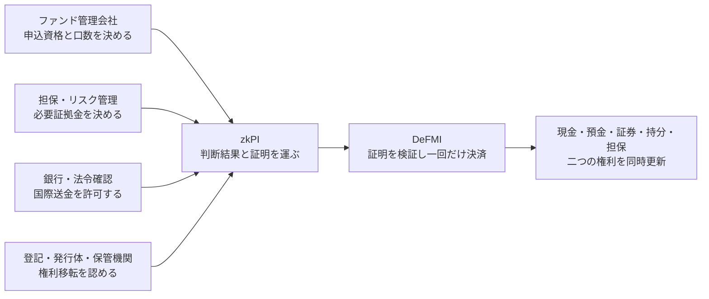

# DeFMIとzkPIをQOMMなしで使う用途

調査日: 2026-08-30

## 結論

DeFMIとzkPIは、QOMM専用の部品ではない。QOMMは、取引条件を決めてzkPIを発行する
「上流システム」の一例にすぎない。

ほかの業務システムが支払・資産移転の条件を決め、その判断が正しいことをzkPIに載せれば、
DeFMIは元データを見ずに決済できる。この形が有効なのは、次の三条件がそろう業務である。

1. 決済前に、資格、上限、担保、契約条件などを確認しなければならない。
2. その確認に使った個人情報、保有資産、取引額、社内判断を決済参加者全員へ見せたくない。
3. 条件を満たした後は、片方だけが実行されたり、同じ指図が二度使われたりしてはならない。

最初に作る用途としては、**ファンドの申込・解約**が最も現実的である。研究として最も強いのは、
**担保・証拠金の差入れと返却**である。長期の事業用途として最も大きいのは、
**銀行間・国際決済の同時決済**である。

これらは「秘密の見積もり」ではない。価格規則のMPC評価、Maker/Taker、RFQは必要ない。

## 三つの役割を分ける

### zkPI

zkPIは *zero-knowledge payment instruction*、日本語では「ゼロ知識証明付き決済指図」である。

業務システムが決めた結果について、次のような事実だけを証明して渡す。

- 指図を出した主体が正しく認可されている。
- 支払者と受取者が必要な資格を持つ。
- 金額、資産、期限、利用上限が許可範囲内にある。
- 必要な残高、担保、権利が事前に確保されている。
- 同じ権利や指図を二度使っていない。

氏名、口座番号、元の契約、保有残高、審査資料を指図にそのまま載せる必要はない。

### DeFMI

DeFMIは *decentralized financial market infrastructure*、日本語では「分散型金融市場基盤」
である。単一の運営者ではなく、複数組織が共同で正本台帳を維持する。

DeFMIが判断するのは、価格や契約内容の妥当性ではない。zkPIの証明、署名、有効期限、
一回限りの識別子を確認し、現金と資産、二通貨、担保と債務などを「両方とも動かすか、
どちらも動かさないか」で更新する。

### 上流の業務システム

誰に、何を、どの条件で動かしてよいかを決める主体である。用途ごとに異なる。

QOMMを使う場合だけ、上流に「秘密の問い合わせと価格選択」が加わる。本資料の用途は、
QOMMがなくても成立する。

## 越境決済は二つの別シナリオとして扱う

本実装では、次の二つを混同しない。

### 多国籍企業グループ内のPvP/DvP

親会社、海外子会社、社内銀行など、同じ企業グループに属する法人間の決済である。各法人の
会計、資金管理、ERP、カストディと接続し、社内承認、法人別限度、通貨別資金、証券在庫を
一つの法人参加モジュールからDeFMIへ渡す。ここでは企業グループが定めた内部規則と権限階層を
利用できる。

#### MPC停止時の耐久キュー

法人参加モジュールは、MPCノードが一時的に必要数そろわなくても社内システムから受け取った
依頼を失わないよう、暗号化された耐久キューを持つ。ただしMPCの代わりにローカル計算を行ったり、
証明なしでDeFMIへ送ったりはしない。

- 社内承認済みの本文、署名、受付時刻、期限、一回限りの依頼IDを同じ記録として永続化する。
- 送信は「一度だけ」を仮定せず、同じ依頼IDによる再送とDeFMI/MPC側の冪等検査で二重実行を防ぐ。
- 元の受付順を保ち、後から来た有利な依頼だけを先に送らない。
- MPCの必要数が復旧した後も、期限内か、資金・資産の事前確保が有効かを再確認してから送る。
- 期限切れの依頼は自動延長しない。確保済み資産があれば、DeFMI上の明示的な解放処理へ回す。
- キュー本体と鍵を分離し、保存時暗号化、改ざん検知、送信履歴、再試行回数、最終エラーを残す。
- 停止時間、滞留件数、最古の待機時間、期限切れ見込みを管理画面と監査記録へ表示する。
- 問い合わせの有無を隠す設定では、復旧直後に実依頼だけを一斉送信せず、固定受付枠とダミー枠へ
  戻して配信時刻と通信量をそろえる。

状態は少なくとも `受付済み → 待機中 → 送信中 → MPC受付済み → DeFMI確定済み` とし、
そこから `期限切れ`、`解放待ち`、`要手動確認` へ分岐できるようにする。通信障害では
「届かなかった」と「届いたが応答を失った」を区別できないため、再送可能な状態を消すのは
MPCまたはDeFMIの正本受領証を検証した後だけとする。

### 独立企業間のUSDC資金レッグ付きDvP

USDCなどのステーブルコインを代金に使うケースは、同じ企業グループ内に限定しない。売り手と
買い手は資本・権限・社内システムを共有しない独立企業であり、USDCを現金側、証券その他の
資産を資産側とする社間DvPとして扱う。

この場合、社内承認を相手方の信頼根拠にはできない。そのため、法人参加モジュールは各社ごとに
独立して動き、次をzkPIへ結び付ける。

- 各社のKYBと署名権限が有効であること。
- 売り手の資産と買い手のUSDCが、それぞれの管理主体で事前に確保されていること。
- USDCのチェーン、コントラクト、発行体、凍結可能性、確定性の条件が取引時点の規則を満たすこと。
- 二つのレッグが同じ取引識別子、金額、期限を参照し、片方だけでは確定しないこと。
- 失敗、期限切れ、再編成、発行体による凍結などを、社内決済とは別の状態機械で処理すること。

したがって、USDC連携は社内決済機能の設定変更ではなく、外部ステーブルコイン台帳を接続する
交換可能な資金レールとして実装する。企業グループ内の越境決済と共通化するのは、zkPIの形式、
DeFMIの一回限り実行、PvP/DvPの調整器、耐久キュー、監査記録までとする。

## 優先順位

### 1. ファンドの申込・解約・資本払込

#### 何をするか

投資家が現金を払い、ファンド持分を受け取る。解約時は逆に、持分を消却して現金を受け取る。
未公開ファンドでは、適格投資家か、地域制限を満たすか、一投資家当たりの上限を超えないか、
払込資金があるかを先に確認する。

#### 誰がzkPIを作るか

名義書換代理人、ファンド管理会社、本人確認事業者が、次を確認して共同で指図を承認する。

- 投資家資格と本人確認が有効である。
- 申込金額がファンド規約と投資家別上限を満たす。
- 現金が確保され、発行可能口数が残っている。
- 適用する基準価額の時点が確定している。

zkPIは「条件を満たす申込を一回だけ決済してよい」と証明する。DeFMIは現金と持分を同時に
更新する。解約、分配、追加出資、資本払込にも同じ形を使える。

#### 既存例との差

Project Guardianでは、ファンドの申込・解約、資産運用、支払を分散台帳で自動化する実証が
すでに行われている [1][2]。したがって、ファンド持分をトークン化することや、申込と支払を
自動化すること自体は新しくない。

本件の差分候補は、投資家資格、個別上限、申込額を全決済参加者に明かさず、別のファンド管理
システムが作った一回限りのzkPIを、単一運営者のいないDeFMIが共通形式で処理する点にある。

#### 最初の実装に向く理由

現金と持分の二つを同時に動かすため、現在のDeFMIのDvPをそのまま使いやすい。価格競争や
複雑なMPC計算は不要で、発行体、投資家、本人確認機関、DeFMIという少数の役割で試せる。

### 2. 担保・証拠金の差入れ、差替え、返却

#### 何をするか

清算機関、銀行、証券会社は、取引相手のリスクに応じて担保や証拠金を求める。必要額を計算
するには、ポジション、信用枠、相殺契約、ヘアカット、価格変動を使う。しかし、その内訳を
決済を担う全ノードへ公開する必要はない。

#### 誰がzkPIを作るか

清算機関、担保管理機関、または合意済みのリスク計算機が、次を証明する。

- 必要証拠金以上の価値がある適格担保を選んだ。
- 発行体、満期、通貨、集中上限、ヘアカットの規則を満たす。
- 同じ担保を別の債務へ重ねて差し入れていない。
- 返却後にも必要額を下回らない。

DeFMIは、担保の所有権または支配権をロックし、現金、代替担保、債務状態と同時に更新する。

#### 既存例との差

Bank of EnglandのProject Meridian Securitiesは、トークン化証券と中央銀行マネーのDvP、
日中レポ、担保の自動差入れと巻戻しを実証している [3]。したがって、担保移動やレポの自動化、
中央銀行マネーとの同時決済は新規性にならない。

差分候補は、担保選定に使ったポートフォリオ、信用枠、ヘアカットを隠したまま「規則を満たす
担保である」と証明し、その指図を複数組織が運営する共通決済層で実行する点である。

#### 研究課題

- 秘密の保有資産から適格担保を選ぶ計算量。
- 同時に複数の証拠金請求が来たときの枠超過防止。
- 価格急変時の再計算と、古い証明を受け付けない時点管理。
- 返却、差替え、追加差入れを一つの状態機械として証明する方法。
- 証明を通したまま、監督者と当事者だけが必要部分を照合する方法。

### 3. 銀行間・国際決済のPvP

#### 何をするか

二つの通貨を交換するとき、一方だけを先に支払うと決済リスクが生じる。PvPでは、二通貨を
同時に動かす。国内の銀行間振替でも、法令確認、送金上限、資金確保を終えた指図だけを通す。

#### 誰がzkPIを作るか

各銀行の送金・法令確認システムが、顧客情報そのものではなく、次の確認結果をzkPIへ載せる。

- 当事者確認と必要な法令確認が完了した。
- 送金目的、地域、通貨、金額が許可範囲内である。
- 両通貨の資金が期限まで確保されている。
- 使った審査結果と資金予約が同じ指図に結び付いている。

DeFMIは二つの通貨の指図を結び、両方の発行体または決済台帳が受け入れた場合だけ確定する。

#### 既存例との差

Project Juraは、ホールセール中央銀行デジタル通貨間のPvPと、証券・現金の国境をまたぐDvPを
実証した [4]。Project Agoráは、トークン化された中央銀行準備と商業銀行預金を用い、法令確認
後のISO 20022指図、資金ロック、二通貨の同時決済を試験している [5]。Project Mandalaは、
国際送金の規則確認を支払前に行い、その確認結果を支払メッセージへ結び付け、ゼロ知識証明や
MPCで情報を隠す設計を示している [6]。

したがって、PvP、資金ロック、支払前の法令確認、法令確認のゼロ知識証明は、それぞれ既存で
ある。本件の差分は、それらを「特定の国際送金基盤の内部機能」にせず、どの上流システムでも
作れるzkPIと、複数資産を扱うDeFMIの共通境界として定義する点に置く必要がある。

#### 事業上の位置

市場は大きいが、二つの通貨発行体、銀行、既存決済網、法令上の確定性を同時に扱うため、最初の
製品には重い。まずトークン化預金または試験用通貨でPvPを実装し、実RTGSとの接続は別段階に
する。

### 4. 証券の発行、償還、利払、配当

#### 何をするか

証券発行時の現金対証券、満期償還、利払、配当、分割、強制償還を扱う。権利確定日現在の保有、
税区分、投資家資格を証明しつつ、個別保有額を全参加者に見せない。

#### 誰がzkPIを作るか

発行体、証券保管機関、名義書換機関が、発行上限、権利確定日、支払条件、保有証明を確認して
zkPIを作る。DeFMIは、発行・消却と現金支払を一つの状態更新として実行する。

Project GuardianやProject Meridian Securitiesは、発行、取引、決済、保管、資産管理の一連の
流れを既に対象にしている [1][3]。差分は「証券をトークン化したこと」ではなく、異なる発行体
と業務システムが、保有者と金額を広く公開せず同じzkPI形式でDeFMIへ指図できることに置く。

### 5. 不動産・高額資産の引渡しと代金支払

#### 何をするか

所有権移転、代金、融資実行、既存担保の解除、税・手数料支払を、条件がそろった時点でまとめて
実行する。

#### 誰がzkPIを作るか

登記機関、金融機関、エスクロー管理者が、それぞれ自分の権限範囲だけを署名する。zkPIは、
必要な全承認がそろったことと、同じ物件・同じ取引を参照していることを証明する。

Project Meridianは、住宅取引でRTGSと土地登記を同期させる実証を既に行った [7]。したがって、
登記と支払の同時化は新しくない。本件の差分候補は、売買価格、融資残高、当事者情報を共同運営
ノードへ広く開示せず、複数の承認を一つの一回限りの指図へまとめることである。

### 6. 政府・国際機関の約束手形、拠出金、補助金

#### 何をするか

政府から国際機関への拠出、約束手形の発行・保管・償還、条件付き補助金の支払を管理する。
残額、予算科目、受給条件を必要以上に公開せず、承認済み金額だけを一回支払う。

Project Promissaは、政府と国際開発銀行の約束手形をトークン化し、発行から償還までの流れ、
機密性、各参加者の主権を扱っている [8][9]。したがって、約束手形のデジタル化は新しくない。
差分候補は、約束手形の専用基盤ではなく、発行体が作るzkPIをDeFMIが現金・債権・予算枠の
共通指図として処理する点である。

### 7. 売掛債権・請求書金融

#### 何をするか

買い手が承認した請求書を債権として譲渡し、金融機関から前払いを受け、期日に買い手から回収
する。同じ請求書の二重譲渡や二重融資を防ぐ必要がある。

#### 誰がzkPIを作るか

買い手、請求書管理システム、金融機関が、請求書の存在、受領、未譲渡、支払期日、融資上限を
確認する。zkPIの一回限りの識別子に請求書の権利を結び付け、DeFMIが債権移転と前払金を同時に
動かす。

この用途では、請求書が実在し役務が完了したという外部事実をDeFMIだけで保証できない。
買い手や監査者の署名を必須にし、「署名された事実を二重利用せず決済した」ことを保証範囲と
する必要がある。

### 8. 環境価値・商品証書の発行と償却

#### 何をするか

炭素クレジット、再生可能エネルギー証書、倉荷証券などを、代金と同時に移転し、使用済みの
証書を一回だけ償却する。

測定機関、登録簿、倉庫、発行体が元の事実を署名し、zkPIが発行・移転・償却条件を証明する。
DeFMIの一回限りの識別子は二重償却を防げるが、排出削減量や現物在庫が真実かは保証できない。
外部登録簿と監査制度が信頼境界に残る。

### 9. 保険金・給付金の支払

これは保険の「見積もり」ではなく、確定した請求の支払である。保険会社または請求審査機関が、
契約が有効で、免責条件を満たし、承認額が限度内であることを証明するzkPIを作る。DeFMIは、
個別の診療情報、事故資料、補償限度を共同ノードへ見せずに一回だけ支払う。

事故や診療が実在するかは外部審査の責任であり、DeFMIは審査を代替しない。この境界を明確に
すれば、医療、災害、行政給付にも同じ形を使える。

## DeFMIだけ、zkPIだけでも使えるか

### zkPIだけを既存台帳へ接続する

既存の銀行勘定系、証券台帳、ファンド管理台帳にzkPI検証器を追加すれば、DeFMIを採用しなくても
「必要条件を満たす指図だけ受け付ける」ことはできる。ただし、複数台帳をまたぐ同時決済と、
単一運営者に依存しない正本管理は、その既存台帳側で別に解決する必要がある。

### DeFMIへ通常の署名指図を送る

秘密にする条件がない用途なら、通常の電子署名付き指図をDeFMIで処理できる。分散運営、
一回限りの実行、DvP/PvP、発行体権限、照合という価値は残る。ただし、参加資格や限度額を
隠したまま証明する価値は得られない。

### 両方を使う

機密性の高い条件を上流で判断し、複数組織が共同運営する台帳で同時決済する場合に、両者を
組み合わせる意味が最大になる。

## 共通して解くべき技術課題

### 1. 誰の判断を有効とするか

zkPIが数学的に正しくても、無権限の主体が作った指図では意味がない。用途ごとに、本人確認
事業者、発行体、清算機関、登記機関、銀行の公開鍵と権限範囲を登録する必要がある。

### 2. 証明した条件と決済対象を同じものにする

資格証明、資金予約、資産予約、受取先、期限を一つの指図識別子へ結び付ける。別取引の証明を
付け替えられないことを、型、署名、コミットメントで保証する。

### 3. 同時指図と枠超過を防ぐ

同じ法人が複数の申込、担保請求、送金を同時に出しても、合計で残高や保証枠を超えてはならない。
DeFMIは予約済み額を正本状態に含め、決定的な順番で指図を適用する。競合した後続指図は、
証明が正しくても残余枠不足として失敗させる。

### 4. 外部台帳と失敗をそろえる

DeFMI外の現金台帳や登記簿を使う場合、片方だけが確定しないよう、事前ロック、期限、取消条件、
署名付き受領証を定める。外部台帳が原子的更新を提供しない場合、「完全な同時決済」を主張して
はならない。

### 5. 必要な相手だけが後から確認できるようにする

監督者、監査人、当事者、発行体は異なる情報を必要とする。全公開か完全秘匿かの二択にせず、
閲覧鍵と署名付き照合記録で、誰が何を見たかを残す。

### 6. 法的な確定時点を定める

暗号学的に状態が確定しても、破産時にその移転が法的に有効とは限らない。資産ごとに、正本、
発行体、取消可能性、最終性、準拠法を定める必要がある。

## 新規性を主張できる範囲

既存プロジェクトを踏まえると、次は単独では新規性にならない。

- DvPまたはPvPを分散台帳で行う。
- トークン化預金、証券、ファンド持分、約束手形を発行する。
- 支払前に法令確認をする。
- 法令確認の結果をゼロ知識証明で示す。
- 担保差入れ、レポ、ファンド申込を自動化する。

本研究で検証すべき差分は、次の組合せである。

1. **業務判断と決済の分離**: ファンド管理、担保計算、銀行審査、登記など異なる上流が、
   共通のzkPIを作る。
2. **元データを復元しない決済**: DeFMIノードは、当事者、金額、保有資産、判断規則の必要以上の
   部分を読まずに指図を検証する。
3. **一回限りの権利**: 資金予約、担保、請求書、証書、承認を別の指図へ再利用できない。
4. **資産横断**: 現金、預金、証券、ファンド持分、担保、商品証書を、同じ指図境界で扱う。
5. **分散運営と外部権限の両立**: DeFMIノードだけでは資産を勝手に発行できず、発行体、登記機関、
   清算機関の権限を証明へ残す。
6. **選択的な事後照合**: 普段は秘密を保ち、紛争・監査・監督時には必要な相手だけが確認できる。

現時点では「世界初」とは主張しない。公開された先行プロジェクトと実装をさらに機能単位で
比較し、この六項目を同時に満たす方式が見つからない場合に、統合方式と安全性定義の差分として
主張する。

## 実装順

### 第1段階: ファンド申込・解約

- 発行体、ファンド管理者、投資家、本人確認者を別鍵にする。
- 投資家資格、申込上限、資金予約、発行可能口数をzkPIへ結ぶ。
- 現金ノートと持分ノートをDeFMIで同時更新する。
- 同時申込による上限超過、期限切れ、指図再利用、片脚失敗を試験する。

### 第2段階: 担保・証拠金

- 適格担保、ヘアカット、集中上限を承認済み回路にする。
- ポートフォリオを見せずに必要額以上であることを証明する。
- 追加差入れ、差替え、返却を実装する。
- 複数請求の順番と、法人・清算参加者ごとの合計枠を正本状態で管理する。

### 第3段階: 二通貨PvP

- 二つの発行体と二つの資金予約を一つのzkPIへ結ぶ。
- 片方の発行体停止、期限切れ、再起動、メッセージ再送を試験する。
- ISO 20022との対応は外部アダプターに置き、DeFMI内部の型を特定銀行の電文へ固定しない。

### 第4段階: 外部台帳接続

- 模擬のファンド台帳、担保台帳、銀行台帳を独立プロセスとして動かす。
- 署名付き予約と確定受領証を接続する。
- どの障害で原子的更新が崩れるかを明示し、崩れる構成はDvP/PvPと呼ばない。

## 現在の実装との関係

現在のコードには、型付きzkPI、署名と証明の検証、一回限りの識別子、口座名を公開しない
ノート型台帳、同一台帳内のDvP/PvP、発行体権限、事前予約、照合記録の土台がある。これらは
QOMM以外の上流からも呼べる。

一方、実在するファンド管理会社、清算機関、銀行、CSD、登記機関とは接続していない。外部の
本人確認、物理HSM、複数法人による7拠点運用、法的最終性、第三者監査も未完了である。
したがって、現状は再利用可能な決済プロトコルと試験実装であり、実運用接続済み製品ではない。

## 推奨する一本目

### 製品MVP

**適格投資家向けファンドの申込・解約**を選ぶ。

- QOMMを使わず、ファンド管理者がzkPIを発行する。
- 現金と持分をDeFMIで同時に動かす。
- 投資家資格、個別上限、申込額を共同ノードへ公開しない。
- 既存のProject Guardianとの差を、分散運営、一回限りの共通指図、元データ非開示で測る。

### 論文

**秘密のポートフォリオに対する担保・証拠金指図**を選ぶ。

中心課題は、「異なるリスク計算機が作った、秘密の担保充足証明を載せた指図を、分散決済層が
同時実行し、同時請求でも二重使用と枠超過を防げるか」である。既存のトークン化レポ実証との差が
明確で、性能、安全性、情報漏えい、流動性利用効率を比較できる。

## 参考資料

[1] Monetary Authority of Singapore, “MAS Announces Plans to Support Commercialisation of
Asset Tokenisation,” 2024-11-04.
<https://www.sgpc.gov.sg/api/file/getfile/MAS%20Media%20Release_MAS%20Announces%20Plans%20to%20Support%20Commercialisation%20of%20Asset%20Tokenisation.pdf?path=%2Fsgpcmedia%2Fmedia_releases%2Fmas%2Fpress_release%2FP-20241104-2%2Fattachment%2FMAS+Media+Release_MAS+Announces+Plans+to+Support+Commercialisation+of+Asset+Tokenisation.pdf>

[2] J.P. Morgan, “Project Guardian.”
<https://www.jpmorgan.com/kinexys/project-guardian>

[3] Bank of England, “Project Meridian Securities,” 2025.
<https://www.bankofengland.co.uk/payment-and-settlement/rtgs-future-roadmap/project-meridian-securities>

[4] BIS Innovation Hub, “Project Jura: cross-border settlement using wholesale CBDC,” 2021.
<https://www.bis.org/publications/project-jura-cross-border-settlement-using-wholesale-cbdc>

[5] BIS Innovation Hub, “Project Agorá.”
<https://www.bis.org/project/agora>

[6] BIS Innovation Hub, “Project Mandala: shaping the future of cross-border payments compliance,”
2024.
<https://www.bis.org/publ/othp87.pdf>

[7] Bank of England, “What is synchronisation?”
<https://www.bankofengland.co.uk/payment-and-settlement/rtgs-future-roadmap/what-is-synchro>

[8] BIS Innovation Hub, “Project Promissa.”
<https://www.bis.org/about/bisih/topics/fmis/promissa.htm>

[9] BIS Innovation Hub, “Project Promissa: Exploring the tokenisation of promissory notes,” 2025.
<https://www.bis.org/publ/othp93.pdf>
