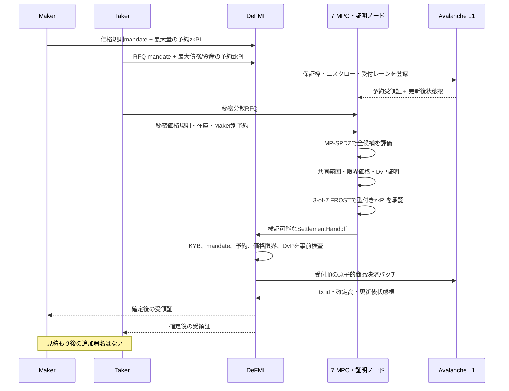

# MPCからzkPIを作り、DeFMIで決済するまで

> MakerとTakerの事前承認、秘密計算、zkPI、保証枠、同時RFQ、専用Avalanche L1を、現在の実装に沿って説明する

更新日: 2026-08-29

## 1. 結論

現在は、次の経路が一つの受入試験として接続されている。

1. Makerは、秘密の価格規則を登録するときに、最大執行可能量と自動約定への委任へ署名する。
2. Takerは、RFQを送るときに、数量、限界価格、期限、決済上限と自動決済への委任へ署名する。
3. DeFMIは、Makerの在庫または購入余力と、Takerの資産または保証余力を先に予約する。
4. 7つのMPCノードは、問い合わせをMakerへ送らず、秘密の価格規則と在庫をMP-SPDZで評価する。勝者の予約額が実際の受渡額を満たすことも、同じ実行から共同証明する。
5. 各証明ノードは自分の秘密分散値だけを使い、共同範囲証明、Taker限界価格との関係証明、DvP証明を作る。
6. 3-of-7のFROST署名が、MPC価格ジョブの要約、価格、役割、両者の事前承認、予約受領証、受付順、参照市場、DeFMIの更新前状態根を一つの型付きzkPIへ結ぶ。
7. DeFMIは、MakerにもTakerにも追加署名を求めず、Maker予約とTaker予約の一回限りノートを消費し、証券・現金の受渡請求権を原子的に確定する。
8. 専用の非EVM Avalanche L1が、受付順、予約の通し番号、保証枠、状態根、使用済みserial、受渡・返却請求権を合意対象にする。安定した当事者口座は指定しない。

したがって、価格を見た後に署名を拒む「探り」は、製品経路には存在しない。両者の同意はなくしたのではなく、価格が決まる前へ移した。

この結論には二つの境界がある。第一に、受入試験は5つのAvalancheGo検証者、7つのMPC・証明プロセスを一台のホスト上で動かしている。外部KYB事業者が署名したassertionを受け取る境界と、外部CSD署名プロセスを呼ぶ境界までは実装したが、実事業者の本番API・契約、7組織・7物理拠点の実WAN、物理HSM、独立暗号監査、法的な決済最終性は未完了である。

第二に、登録済み価格規則の評価、適格Makerの非省略、最良価格の選択については、実MP-SPDZが保存した各ノードの断片から完全Quote証明を共同生成し、通常のRust検証器で検査するところまで実装した。ただし、この検証を行うのは7つの証明ノードであり、Avalanche検証者自身ではない。専用VMは、証明ノードが検査した価格ジョブの要約と3-of-7承認を検査する。したがって、現在の明示的な信頼前提は依然としてk-of-nであり、誰でもAvalanche上だけで全MPC計算を再検証できる方式ではない。

## 2. 用語と役割

- **QOMM**: 問い合わせをMakerへ見せず、MPCがMakerの代理として価格を計算する市場。
- **zkPI**: zero-knowledge Payment Instruction。価格、数量、資産などを隠したまま検査できる支払・受渡し指図。
- **DeFMI**: Decentralized Financial Market Infrastructure。株式だけでなく、現金、債券、投資信託、商品、カーボンクレジットなどを登録、予約、移転、決済する分散型金融市場基盤。
- **Maker**: 価格規則と執行可能量を事前登録する側。
- **Taker**: 条件付きの問い合わせを送る側。
- **保証主体**: CCP、銀行、または自己保証を行う参加者。三者は同じ保証枠状態機械を使う。

Maker/Takerと、現金支払者/資産引渡者は同じ分類ではない。

| 取引方向 | 現金を払う | 資産を渡す |
|---|---|---|
| Takerが買う | Taker | 勝者Maker |
| Takerが売る | 勝者Maker | Taker |

`qomm-zkpi::typed::ExecutionContext`は、売買方向、Maker/Takerの秘匿ハンドル、両予約ID、RFQヌリファイアを保持し、この役割対応を検査する。

## 3. 実装された取引経路



受入入口は`avalanche/defmivm/scripts/run-full-qomm-l1.sh`である。内部では次を順に呼ぶ。

```text
run_pretrade_reservations
  -> seven_node_cluster / qomm_node_party
  -> build_settlement_contexts
  -> seven_node_cluster --finalize-handoff
  -> settle_finalized_batch
  -> defmivm.issueProductSettlementBatch
```

### 3.1 事前承認ファイル

`PretradeAuthorityBundle`は次をまとめる。

- Makerごとの`MakerPolicyMandate`
- Takerごとの`TakerExecutionMandate`
- 匿名KYB提示と署名済み資格集合
- 7ノードが署名した、実RFQとダミーを含む全受付レーン
- 資産、会場、DeFMI、資格範囲

Maker mandateは、Makerの法人コミットメント、ハンドル、資産、方向、価格規則の要約と版、予約ID、最大量コミットメント、期限を含む。Taker mandateは、Takerの法人コミットメント、ハンドル、資産、方向、最大量、限界価格、手数料上限、RFQヌリファイア、期限を含む。

Makerの価格規則要約は、任意の説明文字列ではない。Maker番号、対象資産、登録済み価格規則の9個のcommitmentから決定的に作る。完全Quote証明が確定した時点で、各証明ノードは勝者位置の登録規則から同じ要約を再計算し、Maker mandate、DeFMI予約受領証、最終zkPI文脈の三つと一致しなければ署名を出さない。

どちらも正規化したバイト列へEd25519署名する。各証明ノードは、FROST署名を始める前に、その署名と全フィールドを独立に再検査する。調整役が任意の要約値だけを与えて署名させることはできない。

受入ファイルには、所有者ウォレットの代わりに予約証明を作るための最大量の開封値が含まれる。本番ではこの開封値を中央ファイルへ集めず、Maker/Takerのウォレットまたはカストディアンが予約証明をDeFMIへ直接提出する。これは受入fixtureと本番の秘密境界の明示的な差である。

### 3.2 MakerとTakerの予約

DeFMIは、見積もり前に両者の最大責任額を実際の状態から外す。

```text
利用可能額 before = 利用可能額 after + 予約額
予約済み額 after   = 予約済み額 before + 予約額
```

各値はPedersenコミットメントで保存する。`CreditFacilityRelationProof`は、予約後の利用可能額と予約額が非負の範囲にあり、上式が成り立つことを証明する。予約額の平文はAvalancheへ送らない。

予約は保証枠だけでなく、実資産のエスクロー移転とも結ぶ。`ReservationEscrowProof`、型付き予約zkPI、`AssetLinkProof`により、次が同じ値・同じ資産であることを検査する。

```text
署名済みmandateの最大量
= 保証枠から確保した量
= 所有者口座から予約口座へ移した量
= 予約zkPIの数量
```

Maker予約には価格規則の要約と版を必須にする。Taker予約には一度だけ使えるRFQヌリファイアと受付順を必須にする。

### 3.3 保証枠の正本

保証主体は三種類ある。

```text
CentralCounterparty  CCP保証
Bank                 銀行保証
SelfGuaranteed       自己担保・自己保証
```

`GuarantorDefinition`は、保証主体ID、種類、公開鍵、リスク方針の要約を持つ。`CreditFacilityGrant`は、対象法人、資産レール、上限、利用可能額、担保、期限、保証主体署名を持つ。`CreditFacilityControl`は凍結、閉鎖、不履行を扱い、`CreditFacilityAmendment`は増減額や期限変更を扱う。

一つの経済主体が複数ウォレットや複数資格を使っても、利用可能枠を分裂させないため、正本上の一意性は次の組で強制する。

```text
法人コミットメント + 保証主体ID + 資産レールID
```

同じ組に二つの有効な保証枠は作れない。CCPだけに依存せず、銀行保証と自己保証も同じ二重使用防止規則を使う。

### 3.4 内容に依存しない受付順

各スロットは、実RFQとダミーを同じ大きさ・同じ時刻枠で受け付ける。7ノードは全レーンへ署名し、スロット閉鎖後の乱数から内容に依存しない順序を確定する。

DeFMI/Avalancheは、受付帳票を単に保存するだけでなく、次を強制する。

- 全レーンが1から始まる連続番号である。
- ダミーも実RFQと同じように順番を消費する。
- Taker予約は、自分の署名済み受付レーンと一致する。
- 決済バッチ内の`admission_sequence`は厳密な昇順である。
- 同じレーン、同じRFQヌリファイア、同じ受付票は再利用できない。

到着時刻、価格、数量、ウォレットが処理優先度を直接決めることはない。

## 4. MPCと共同証明

### 4.1 秘密価格計算

MP-SPDZは、各Makerについて概念的に次を評価する。

```text
価格_i = P_i(秘密RFQ, 秘密在庫_i, 参照市場)
価格適格_i = 対象資産 AND 数量上限 AND 稼働中 AND 有効期限内
勝者    = 適格な全Makerのうち最良
決済可能 = 勝者の予約額 - 実際の受渡額 >= 0（資産脚と現金脚の両方）
```

Taker買いでは最小の売値、Taker売りでは最大の買値を選ぶ。勝者Makerの予約ID、価格規則の版、方向に応じた現金側・資産側の予約を同時に選ぶため、別Makerの予約や逆方向の予約を差し替えられない。勝者の予約が不足すれば共同DvP証明と最終zkPI署名を作れず、正確な価格もTakerへ返さない。現在の一回限り予約方式では、同じ受付群の中で不足した勝者を除外して次点へ自動的に回すのではなく、統一形式の不成立として終え、Makerが予約を更新した後の新しい受付群で再計算する。

#### 4.1.1 RFQごとの14要素と、Makerの常設状態

Takerの数量・指値・予約は、Makerの常設入力へ混ぜない。RFQごとに次の14要素を固定順序で作り、7ノードへ秘密分散する。

```text
1  資産の会場内番号          8  指値の乱数
2  数量                      9  約定量応答の一回限りマスク
3  売買方向                 10  数量commitmentの乱数
4  法人単位の秘密番号       11  Taker証券予約額
5  実RFQかダミーか          12  Taker証券予約の乱数
6  価格応答の一回限りマスク 13  Taker現金予約額
7  執行可能な指値           14  Taker現金予約の乱数
```

買いでは現金予約だけ、売りでは証券予約だけを設定し、使わない側はゼロにする。Rustの型付き生成器は共有前に、Taker署名、受付slot、資産、方向、数量・指値・最大予約の各commitmentを開封値から再計算する。乱数は`u128`へ狭めず、Ristrettoの完全なスカラーをそのままMPC体要素へ写す。

Maker側は各Makerにつき、証券予約額と乱数、現金予約額と乱数、決済ハンドルの5要素をノード別の暗号化常設状態として持つ。Takerの値をここへ保存しない。ダミーRFQも14要素、通信量、回路形状を変えず、価格応答と約定量のマスクだけは毎回ランダムにする。さらに回路内の秘密な実RFQ判定で、公開応答と永続化する勝者証人をゼロ化するため、ダミー経路から無料の価格を読めない。

### 4.2 各ノードの秘密境界

7ノードのMPC出力と証明用秘密は、ノード別の暗号化状態へ保存する。`serve_proof_party`または`qomm_node_party`は自分の状態だけを読む。

調整役が受け取るのは次だけである。

- 公開評価値と公開コミットメント
- 封印済みの第一応答
- Fiat-Shamir課題
- 第二応答
- FROST公開パッケージ、署名commitment、署名share

Shamir share、証明用乱数、FROST長期鍵片、一回限りnonceはノード外へ出ない。共同証明の調整役は、全秘密を復元する証明者ではない。

### 4.3 FROST DKGと署名

`StdioFrostCluster`は受入用に7個の独立プロセスを起動し、公開DKGメッセージだけを中継する。本番用の`serve_proof_party`は同じ要求形式を相互TLSで受ける。

各ノードは次を自分の暗号化状態へ保存する。

- DKGの本人鍵、確認済み参加者一覧、初期化ID
- 第1段階の秘密状態と公開応答、第2段階の秘密状態と宛先別暗号文
- 最終鍵片とグループ公開鍵
- 使用済み署名ジョブ
- 一回限りnonceの状態

参加者確認後、第1段階の一部完了後、第2段階の一部完了後、最終確定の一部完了後の
どこでノードまたは調整役が停止しても、同じ初期化IDと同じ参加者表に限り再開できる。
別の初期化ID、参加者差し替え、自ノードの第1段階応答の置換は拒否する。完全Quote証明の有無、
各ビット幅、しきい値、DeFMI検査鍵も暗号化状態と長期ノードIDへ結び、起動後に同じ鍵片のまま
安全設定だけを変えることはできない。

3-of-7署名は、署名用の公開値を出す段階と、署名断片を出す段階に分ける。処理IDと署名対象の要約が一致しない再試行、一回限り乱数の再利用、別の事前承認への差し替えを拒否する。

予約用zkPIもこの経路を使う。各ノードはMaker/Taker mandateを復号せずに公開署名を検査し、自分が承認したmandateの最大量、ハンドル、予約ID、価格規則、RFQ、期限、DeFMI状態根と一致するpayment/contextだけへ署名する。試験用`deal_quorum()`は製品受入経路で使わない。

### 4.4 型付きzkPI

旧`Instruction`は、数量、価格、資産のコミットメント、支払者/受取者ハンドル、期限、nonce、見積もりキーまたはMPC価格ジョブ要約への結合、FROST署名を持つ。製品経路では、その外側に`TypedInstruction`を置く。

`ExecutionContext`は次を追加する。

- `Reserve`、`Consume`、`Release`、`Settle`の操作種別
- Maker、Taker、共同の承認範囲
- 売買方向
- 会場IDとDeFMI ID
- Maker、Taker、予約口座の秘匿ハンドル
- Maker/Takerの予約IDと通し番号
- RFQヌリファイア
- Taker mandate、Maker policy、Maker mandateの要約
- 両予約受領証の要約
- MPC価格ジョブ、限界価格関係証明、参照市場文の要約
- 更新前のDeFMI状態根

第二のFROST署名が、旧zkPIの要約とこの実行文脈を結ぶ。したがって、旧形式の検証に通るだけでは製品決済に入れず、型付き署名まで通る必要がある。

### 4.5 DvP証明

決済は、次の等式を平文を出さずに証明する。

```text
資産脚の数量 = zkPI数量
現金脚の金額 = zkPI数量 x zkPI価格
決済後の両残高 >= 0
消費した予約額 = 実決済額 + 返却額
```

`ThresholdDvpPackage`は、各ノードの秘密分散値から共同生成した積・残量証明を持つ。`AssetLinkProof`はzkPIの秘密資産タグとDeFMIの資産IDを結ぶ。単一の`build_package()`へMaker/Taker双方の残高秘密を集める旧試験経路は残るが、製品受入は`build_threshold_package_from_proofs()`を使う。

## 5. DeFMIは何を正本として保存するか

### 5.1 現在の製品経路は口座を名指ししないノート型

ゼロ知識証明だけでは、どの状態を更新するかは決まらない。現在の全商品受入では、専用Avalanche L1が一回限りのノートと使用済みserialを正本として持つ。安定した口座番号、会場別口座ハンドル、入力ノートの位置は決済文へ出さない。

```text
assets[asset_id]
notes[note_id] = asset_id, 一回限り公開点, 金額コミットメント,
                 暗号化された開示値, reservation lock
note_serials[serial] = 使用済み入力の再利用防止
note_reservations[hold_id] = 予約ノート, 委任要約, active/consumed
note_claims[claim_id] = asset_id, 金額コミットメント,
                        一回限り受取人コミットメント, delivery/refund
csd_issuers[issuer_id] = 発行者公開鍵, 許可資産, 有効期間, 状態
guarantors[guarantor_id]
credit_facilities[facility_id]
credit_holds[hold_id]
reservation_bindings[reserve_id]
admission_batches[batch_id]
nullifiers[nullifier]
receipts[operation_id]
```

取引前の予約では、保有者が匿名集合のどの入力ノートを使ったかを明かさず、その一つを使う権利と金額保存を証明する。VMへ出るのは匿名集合の根、使用済みserial、予約額コミットメント、予約にロックされた新しいノート、釣銭ノート、証明要約である。予約ノートは`hold_id`へロックされ、通常の支出には使えない。

決済時には、MakerとTakerの予約ノートをそれぞれ一度だけ消費し、各予約につき次の二つを作る。

```text
delivery claim = 実際に相手へ渡す量
refund claim   = 予約上限から使わなかった量
```

請求権の受取人は、安定した口座ではなく、`RFQヌリファイア + 資産 + hold + delivery/refund`へ結ばれた一回限りのコミットメントで指定する。したがって、同じ参加者の別取引を公開状態だけで直接つなぐ安定識別子はない。

### 5.2 決済確定と、請求権をノートへ変える操作は別

受渡しは`delivery claim`と`refund claim`がL1で作られた時点で最終確定する。受取人が後からその請求権を通常の支出可能ノートへ変える`MaterializeNoteClaim`は、次の受取操作に過ぎない。

- Maker/Takerへ見積もり後の署名を求めない。
- 元の請求権と同じ資産ID・金額コミットメントでなければ拒否する。
- 一回限りの受取人秘密を知る証明を要求する。
- 予約ロックを新しいノートへ持ち越さない。
- 請求権を`materialized`にして再利用を拒否する。
- ノート化しなくても、成立したDvPと相手方の受渡請求権は取消されない。

現在も口座型の`Ledger`、`ProductSettlementOrder`、通常`Settle`は比較・互換試験用に残る。しかし`run-full-qomm-l1.sh --account-free-notes`が使う製品受入の正本は`ProductNoteSettlementOrder`とノート・請求権の状態機械である。受入成果物は`source_accounts_used: 0`、`destination_accounts_used: 0`を記録する。

## 6. 同時RFQと枠超過防止

### 6.1 Takerの合計枠

買いRFQは、概念的に次の最大債務を先に予約する。

```text
最大債務 = 数量 x Taker上限価格 + 最大手数料
```

売りRFQは最大売却数量を予約する。同一法人が複数ウォレットからRFQを送っても、同じ法人・保証主体・レールの一意な保証枠へ集約する。

```text
利用可能100
RFQ-Aが70を予約 -> 利用可能30
RFQ-Bが50を予約 -> 拒否
```

二件が同じ更新前状態を読んだ場合、両方がローカル計算上は枠内でも、同じ`before_sequence`と状態根を消費しようとする。Avalancheで先に確定した一件だけが成功し、後続は`settlement references stale state`で、枠、資産、ヌリファイアを一切変更せず拒否される。

### 6.2 Makerの合計予約

Makerごとの予約は、価格規則の要約・版・資産・方向へ結ばれる。現在の製品経路では予約ノートは一回限りであり、一件の決済で実際の受渡分と返却分へ完全に分割して`consumed`になる。複数RFQが同じMaker予約を参照しても、同じ`hold_id`、予約ノート、serialを二度使えないため、一件しか確定しない。原子的バッチ内で重複していればバッチ全体を送信前に拒否し、別取引として競合すれば先に確定した一件の後で古い状態を使う後続を拒否する。

約定後に残量を再利用する形式ではないので、次のRFQへ参加するにはMakerが新しい予約ノートを作る。古い正確な価格は、DvP残量証明と最終署名が完成する前にはTakerへ返さない。競合後は新しい予約と状態で再計算するか、統一形式の不成立を返す。

### 6.3 独立RFQの原子的バッチ

互いに異なる予約と保証枠を使うRFQは、`ProductSettlementBatch`へまとめられる。バッチは次を検査する。

- メンバーが受付順の厳密な昇順である。
- 同じ予約、ヌリファイア、予約ノート、使用済みserial、出力請求権を二件が共有しない。
- 全メンバーが同じ更新前状態根に対する承認を持つ。
- 全証明とmandateを送信前に検査する。

Avalancheは全メンバーを一つのトランザクションで適用する。一件でも失敗すれば全件を拒否し、部分約定を作らない。

## 7. DeFMIからAvalancheへ

### 7.1 二段階の検証境界

Rust側のDeFMIは、次の秘密証明を送信前に検査する。

- Maker/Takerの署名済みmandate
- 匿名KYB資格、期限、失効、会場範囲
- 予約用・決済用の型付きzkPI
- 価格限界証明、資産結合証明、共同DvP証明
- 保証枠の関係証明

専用Avalanche VMは証明バイト列全体を再計算しない。VMは、Rust側の検証結果を表す証明要約、取引文、実Chain ID、更新前状態根に対する3-of-7ガバナンス署名を検査し、状態機械の不変条件を再検査する。

これは、MPC・証明委員会をk-of-nで信頼する現在の設計に対応する。Avalanche検証者自身に全暗号検証器を載せる場合は、VMへRust検証器相当を移植する別作業が必要である。

### 7.2 原子的確定と復旧

`FacilityAvalancheBridge`は、全秘密証明をロールバック可能なSQLiteトランザクションで事前検査してからL1へ送る。L1受理後に同じ状態遷移をローカル投影へ適用し、更新後状態根が一致することを確認する。

商品バッチには、L1受理直後・ローカル反映前に停止した場合の入口を分離している。

```text
submit_product_threshold_batch   L1へ受理、ローカルは未更新
settle_product_threshold_batch   同じ決定的txを再送し、受理済みtxを確認して投影
```

再試行は同じ取引IDを返し、第二の取引を作らない。受入試験はこの停止窓を意図的に作り、ローカル状態が変わっていないこと、再試行で同じ取引IDを使うこと、最終状態根がL1と一致することを検査する。

さらにnode3を再起動し、5検証者が同じ商品決済後状態根へ戻ることを検査する。

## 8. DP公開とKYB

個別価格の決済経路と、市場統計の公開経路は分離する。正確な価格は成立した取引の当事者だけへ返し、市場統計は`PublicationLedger`で次を一つの遷移にする。

1. 7ノードの入力をMP-SPDZで集計する。
2. 各ノード由来の乱数から分散DP雑音を作る。
3. 法人・公開系列ごとのprivacy budgetを原子的に消費する。
4. 3-of-7公開証明を付ける。
5. 同じ公開要求の再実行と、出力改変を拒否する。

DPは決済の成立条件ではない。DPなしでも、問い合わせ秘匿、事前予約、自動決済、枠超過防止は成立する。DPは、安全な市場情報公開を比較実験する第二段階である。

匿名KYBのライフサイクルは`KybLifecycleService`が扱う。発行、期更新、失効根、会場キャッシュ、監査記録、期限切れ・別会場・再利用拒否を永続化する。

さらに`external_kyb.rs`は、外部事業者の署名済みassertionについて、事業者・鍵・対象システム、保証水準、状態の期、有効期間、取消し一覧、署名を検査する。個別法人を表す`subject_digest`と、親子会社などを共通上限へまとめる`control_group_digest`は別フィールドである。QOMMは後者から匿名の保護単位を作り、生のLEIや事業者内IDをMPCノードへ渡さない。ファイル入力は、シンボリックリンクや他者書込み可能ファイルを拒否し、検査した同じファイル記述子から読む。

受入で使う署名済みassertionは実装fixtureであり、実KYB事業者の本番API、取消し配信、契約、グループ判定の責任分界を接続したものではない。

## 9. 受入結果

`artifacts/avalanche_qomm_full_acceptance.json`は、次を一つの実行で確認する。

- AvalancheGo検証者: 5
- MPC・証明プロセス: 7
- FROST閾値: 3-of-7
- 予約署名で秘密鍵片を中央収集: なし
- 同一法人の競合RFQ: 古い状態として拒否、状態変更なし
- 独立した実RFQ: 2件を一つのAvalancheトランザクションで決済
- 正本方式: 安定口座を使わないノート型。消費した予約ノート4件、作成した受渡・返却請求権8件
- 口座IDの作成・利用: 0件
- 請求権の後段ノート化: 1件を実行し、資産・金額不変と一回限り受取証明を確認
- 見積もり後のMaker/Taker署名: なし
- 外部KYB入力: 署名検証、法人と支配グループの分離、生の法人識別子非開示を確認
- CSD署名: DeFMI外の固定コマンドで実行し、DeFMIは秘密鍵を読まない。物理HSM確認は`false`
- 5検証者の状態根: 一致
- L1確定後の投影停止窓: 同一取引IDで復旧
- node3再起動: 同じ状態根へ復旧

`artifacts/distributed_publication.json`は、7個のMP-SPDZプロセス、分散雑音、3-of-7署名、予算消費、再実行・改変拒否を確認する。

両受入はいずれも物理ホスト1台で実行しており、物理7拠点の証拠ではない。Avalanche成果物は`runtime.physical_hosts: 1`、分散DP成果物は`environment`へこの条件を記録する。

## 10. 実装済みと外部未了の境界

| 領域 | 状態 |
|---|---|
| Maker/Taker事前承認、見積もり後の追加署名なし | 実装・受入済み |
| 予約用と決済用の型付きzkPI | 実装・受入済み |
| 秘密価格規則、買い/売り、Maker別予約選択 | 実MP-SPDZで受入済み |
| ノード別秘密状態、共同範囲・限界価格・DvP証明、FROST DKG・署名 | 7プロセスで受入済み |
| 全価格規則評価・Maker非省略・最良性の共同Quote証明 | 実装・7証明プロセスで受入済み。通常の検証器で読める証明を委員会内で検証し、決済には要約と3-of-7承認を渡す |
| CCP・銀行・自己保証、法人合算枠 | 実装・結合試験済み |
| 内容非依存の受付順、同時RFQ、枠超過拒否 | 実装・Avalanche受入済み |
| 非EVM Avalanche商品決済、停止窓復旧、再起動 | 5検証者で受入済み |
| 分散DP、予算正本、3-of-7公開 | 7プロセスで受入済み |
| KYBの発行・更新・失効サービス | コードと試験は実装済み |
| 外部KYB署名assertionの取込、取消し・期限・対象・保証水準検査 | 実装・受入済み。受入はfixture事業者 |
| 個別法人と企業グループ上限の分離 | 署名形式・実装・試験済み。実事業者の判定規則は未接続 |
| CSD発行者登録、資産別発行許可、外部署名プロセス | 実装・受入済み。物理HSMは未確認 |
| 7ホストWAN配備、FROST初期化、両サービスの相互TLS・再起動・状態継続 | コード・設定・4停止窓の復旧試験・実相互TLS試験は実装済み、実7ホスト未実行 |
| 実KYB事業者の本番API・契約・取消し配信・企業グループ判定 | 未接続 |
| 実HSM、独立監査、侵入・災害復旧訓練 | 未実施 |
| 資産ごとの法的権利と決済最終性 | 制度設計・合意が必要 |
| 口座ハンドルを出さないAvalanche正本 | ノート・serial・一回限り請求権として実装・受入済み |

## 11. 一文で表す現在の完成条件

> Makerが価格規則の登録時に最大予約額をDeFMIへ拘束し、Takerが保証枠または資産を予約して条件付き自動決済へ署名し、MPCが両者へ価格を事前開示せず秘密価格規則を評価して勝者予約の残量を共同証明し、7つの独立証明プロセスが完全Quote・共同範囲・限界価格・DvP証明とMPC価格ジョブへの3-of-7承認を持つ型付きzkPIを生成し、DeFMIが受付順、法人合算枠、予約の通し番号を検査して、専用Avalanche L1上で安定口座を名指しせず、Maker/Takerの予約ノートを一度だけ消費して証券・現金の受渡請求権を原子的に確定する。

この文全体は単一ホスト上の実装受入で確認済みである。本番移行の残りは、物理分離、外部資格発行、鍵装置、独立監査、法的・事業的な運用設計である。
