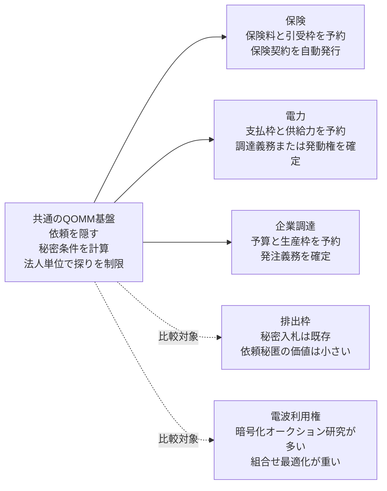
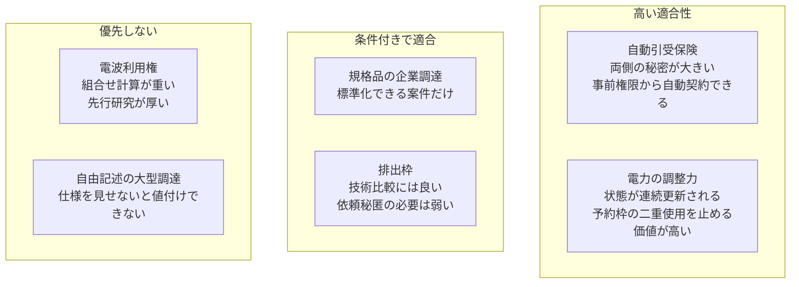

# QOMMをOTC取引の外で使うとしたら

調査日: 2026-08-30

## 結論

OTC取引の外にも用途はある。ただし、単なる「秘密入札」に広げるだけでは新しくない。
秘密入札をMPCで処理する研究は1990年代からあり、2008年には砂糖大根の生産権を移す
実オークションでも使われている [1][2]。電力取引にもMPCを使った実装研究がある [3]。

QOMMの差分が残るのは、次の四つを同時に必要とする市場である。

1. 依頼を受けた全社に、依頼内容を見せたくない。
2. 提供者も、自社の価格条件、引受条件、在庫を公開したくない。
3. 良い回答を見た後で断る余地を残さず、事前に確保した権利から契約を成立させたい。
4. 同じ法人が依頼を繰り返して、他社の条件を推測する行為を抑えたい。

この条件で見ると、優先順位は次のようになる。

1. **自動引受できる保険の見積もりから契約まで**
2. **電力の調整力・供給力の調達と発動**
3. **規格品・生産枠の企業調達**

排出枠と電波利用権のオークションは比較対象として重要だが、最初の事業用途にはしない。
すでに秘密入札と中央清算の仕組みがあり、開催頻度も低い。QOMM固有の「依頼を見せない」
価値が小さいためである。

## 何を転用し、何を変えるのか

現在のQOMMは、金融商品の見積もりを次の形で処理する。

```text
依頼者が資金・保証枠を予約
  -> 依頼を7つに分け、MPCノードへ送る
  -> 各提供者の秘密の価格規則をMPC内で評価
  -> 最良回答と、その回答が正しいことの証明を作る
  -> 事前予約を使う一回限りのzkPIを発行
  -> DeFMIが両方の権利を同時に動かす
```

OTC外でも変えない部分は、秘密分散、秘密規則の評価、提供者の選択、法人単位の利用上限、
一回限りの指図、事後署名を不要にする事前承認である。変えるのは「何を予約し、何を同時に
動かすか」だけである。



## 最も有望: 自動引受できる保険

### 何が漏れているのか

保険の見積もりでは、企業の設備、売上、事故歴、所在地、サイバー対策など、契約しなかった
保険会社にも残したくない情報を複数社へ送る。保険会社側も、料率表、引受限度、再保険の
残り枠、特定リスクに対する選好を競合や仲介者へ見せたくない。

ロンドン保険市場では、すでに提出、見積もり、契約を電子的につなぐ仕組みがある [4]。
またLloyd'sのDigital Platform Provider制度は、保険会社が事前に設定した固定の料率・
引受条件を自動評価し、その場で契約を成立させる運用を認めている [5]。したがって
「秘密の引受規則を機械が評価し、契約まで進める」という前提は空想ではない。

### QOMMに置き換えると

- 依頼者の秘密入力: 企業属性、対象資産、希望補償、免責条件。
- 保険会社の秘密入力: 料率、除外条件、最大引受額、当日の引受余力。
- 事前予約: 保険会社は引受上限、依頼者は保険料の支払枠を予約する。
- MPCの出力: 条件を満たす保険会社、保険料、補償の要約値。
- zkPI: 「この保険料を一度だけ支払い、この条件の保険証券を一度だけ発行してよい」という
  二つの権利を結ぶ。
- DeFMIの役割: 保険料請求権と電子保険証券の発行記録を同じ状態遷移で確定する。

勝った保険会社には契約履行に必要な情報を開示する。負けた保険会社には依頼の存在も詳細も
渡さない。これは、中央プラットフォームが全社へ申込情報を配る現在の電子化とは異なる。

### 研究としての差分

既存制度は、自動引受規則を運用者が管理し、保険会社または委任先が申込データを読める。
本研究では、申込データと各社の引受規則をMPC内だけで照合し、選ばれた一社だけに契約履行に
必要な最小情報を渡す。また、見積もり後の任意の拒否をなくすため、引受枠と支払枠を先に
予約する。

論文で測るべきものは次である。

- 同じ依頼を少しずつ変える探りで、各社の引受境界をどこまで推定できるか。
- 法人単位の回数・金額上限を入れたとき、正常な相見積もりをどれだけ妨げるか。
- 人数、入力項目数、保険会社数に対する計算時間と通信量。
- 平文の一括配信に比べ、負けた保険会社へ残る情報量がどれだけ減るか。
- 自動契約率、価格、参加社数がどう変わるか。

### 適用範囲

最初から自由記述の大型案件を扱わない。Lloyd'sが自動化対象としているような、料率と引受
条件を事前に機械化できる商品から始める [5]。人の判断や追加照会が必要な案件は、MPCの
結果を最終契約ではなく候補選定にだけ使う。その場合は事後拒否が残るため、QOMMの強みは
一段弱くなる。

## 次点: 電力の調整力・供給力

### なぜ合うのか

電力の供給力市場では、参加者が将来供給できる量と価格を秘密入札し、市場運営者が必要量を
満たすよう落札者と清算価格を決める [6]。調整力では、系統運用者がリアルタイムの需給差に
応じて、あらかじめ登録された供給力を発動する。

ここでは、発電事業者の限界費用、停止計画、燃料制約、蓄電池の残量が価格規則に現れる。
一方、系統運用者の依頼量や時点も、そのまま公開すると需給の弱点を示す。両側に隠したい
情報がある。

### 既存研究との差

MPCで電力の入札選択と価格計算を行う研究はすでにある。Abidinらは、2,500件の入札を
オンライン処理で4分未満と報告している [3]。したがって「電力市場へMPCを使った」ことは
新規性にならない。

QOMMとして狙う差分は、単発の秘密入札ではなく、次の状態を連続して扱うことである。

- 各提供者が、残り供給力、蓄電残量、燃料制約を含む秘密の応答規則を登録する。
- 系統運用者の実際の不足量を、落札しなかった提供者へ知らせずに評価する。
- 発動された量だけを各社の予約枠から原子的に減らす。
- 同時に来る複数の発動で、同じ供給力を二重に売らない。
- 法令上必要な落札価格・量は後から公開し、落札前の状態と負けた入札は公開しない。

ENTSO-Eの透明性規則では、調達された調整力について、受理された個別入札の量と価格を
事後公開する項目がある [7]。したがって、ここでの秘密性は「永久に何も公開しない」では
ない。入札中に不要な相手へ漏らさず、所定の時点で所定の情報だけ公開する設計にする。

### zkPIとDeFMIをどう使うか

- 提供者は、一定期間・一定量を供給できる権利を予約する。
- 系統運用者は、調達代金の支払枠を予約する。
- MPCは、価格と系統制約を満たす組合せを選ぶ。
- zkPIは、供給義務または発動権と支払請求権を同時に確定する。
- 現物電力の配送そのものは台帳で完結しない。計量値を外部から取り込み、未達と精算を後段で
  処理する。

最後の点がOTC金融商品との最大の違いである。DeFMIが保証できるのは、契約上の権利・義務と
支払枠の確定までであり、電子が実際に流れたことではない。

## 三番手: 規格品・生産枠の企業調達

### 合う範囲

すべての調達に合うわけではない。仕様を見なければ見積もれない建設工事や研究開発では、
依頼を隠す設計と矛盾する。次のような、事前に商品・品質・納期の表現を標準化できる調達に
限る。

- 半導体、電池材料、燃料などの規格品。
- 工場、倉庫、輸送の時間枠。
- 既に認定された供給者から買う定期補充品。
- 買い手の社名や総需要を、落札前には全供給者へ見せたくない案件。

### 既存研究との差

秘密入札そのものは古い。2008年の砂糖大根オークションでは、入札が農家の経営状態や
生産性を示し、買い手企業がそれを知る懸念が参加行動を歪めるため、三者MPCが実運用された
[2]。安全な秘密入札の実装研究も複数ある [1][8]。

公共調達についても、EU指令は企業が秘密指定した技術・営業情報や入札の秘密部分を発注者が
開示しないよう定めている [9]。一方で、公共調達には公示、公平な参加、落札後の説明責任が
ある。依頼の存在や仕様を隠すQOMMをそのまま持ち込むと、透明性義務と衝突し得る。

したがって最初の対象は公共調達ではなく、企業間の規格品調達にする。QOMMの差分は、
入札価格だけでなく、買い手の注文量・時点と、供給者の数量別価格・残り生産枠の双方を
隠したまま、落札後の発注義務を自動で作る点に置く。

### 限界

物品の品質と配送は台帳だけで確定できない。zkPIでできるのは、発注、保証金、支払留保、
生産枠の予約までである。検収と最終支払には、倉庫、物流、検査機関の署名が必要になる。
この外部依存が、保険と電力より実装範囲を広げる。

## 比較対象: 排出枠と電波利用権

### 排出枠

EU ETSの一次配分は、単一ラウンドの秘密入札・同一価格方式で行われ、参加者の本人確認、
市場監視、落札後の受渡まで制度化されている [10]。最低清算価格を非公開にする運用もある
[11]。秘密の最低価格をMPCで評価し、運営者自身にも見せずに正しい清算だけを証明する題材は
技術的にきれいである。

ただし、販売量と開催日程は公開され、依頼を提供者へ見せない必要が小さい。既存の中央市場を
置き換える制度負担も大きい。QOMMの最初の用途ではなく、秘密の提供条件と公開監査を測る
比較実験に使う。

### 電波利用権

電波利用権は複数の地域・帯域をまとめて入札する組合せ問題になりやすい。入札値と希望帯域を
隠す暗号化オークションは既に多数研究されている [12]。QOMMの現在の「各社の応答を評価して
最良を選ぶ」回路より重く、開催頻度も低い。新規性と事業導入の両方で優先度は低い。

## 位置づけ



## 論文にするなら

### 一本目: 保険

中心命題は「保険に暗号を使った」ではない。次の組合せを検証する。

> 申込情報を負けた保険会社へ配らず、各社の秘密の自動引受規則をMPCで評価し、引受枠と
> 支払枠の事前予約から、選ばれた一社との契約だけを事後署名なしで成立させられるか。

比較対象は、平文で全社へ配る見積もり、一社ずつ聞く方式、通常の秘密入札、QOMMの四つに
する。主指標は、探りによる規則推定の成功率、負けた提供者へ渡った入力項目数、契約成立率、
価格、計算時間、通信量である。

### 二本目: 電力

中心命題は、連続して変わる供給力を二重使用せず、秘密の系統需要と秘密の提供規則を照合し、
法定の事後公開だけを残せるか、である。既存のMPC電力オークション [3] を最も近い先行研究と
し、状態更新、同時発動、事前予約、事後公開の分離を差分にする。

### DPは第一段階に入れない

どちらも、個別回答を秘密にして勝者だけへ返すところまではDPなしで成立する。DPが必要に
なるのは、市場参加者へ平均価格、利用可能量、引受率などを継続公開するときである。
まずMPCとzkPIだけで個別取引を完成させ、その後、同じ実験ログから「公開なし」「単純集計」
「DP付き集計」を比較する。この順番なら、DPが市場情報と探り耐性に与えた効果を分離できる。

## 実装判断

現在のコードを別製品へ分岐させる前に、QOMM内部の次の四つを一般化すればよい。

1. `Request`: 金融商品の数量・方向ではなく、任意の型付き依頼を受け取れるようにする。
2. `ProviderPolicy`: 値付け規則に加え、受諾可否と提供量を返せるようにする。
3. `Reserve`: 資金・在庫だけでなく、引受枠、供給力、生産枠を一回限りで予約する。
4. `Instruction`: DvPだけでなく、権利の発行、義務の成立、支払留保を同じ一回限りの指図で
   表せるようにする。

最初のMVPは、保険会社3社、定型商品1種、入力項目20個以下、固定の引受規則、保険料の
支払予約、電子保険証券の発行までに絞る。ここなら、現在の秘密規則評価、3-of-7共同zkPI、
法人単位の上限、DeFMIの一回限りノートをほぼそのまま再利用できる。

## 主張してよいこと・いけないこと

主張してよいこと:

- 秘密入札ではなく、依頼と提供規則の双方を隠す、事前承認付きの契約成立方式である。
- 落札後の任意の拒否を、事前予約と一回限りの指図で防ぐ。
- 同じ法人による繰り返し照会を、ウォレットではなく法人単位で制限する。
- 保険または電力の状態更新と同時要求を、同じ実装で測る。

主張してはいけないこと:

- 世界初の秘密入札、MPCオークション、秘密の電力市場である。
- 暗号だけで現物の配送、発電、事故対応まで保証できる。
- 公共調達の透明性義務を、そのまま秘密化で置き換えられる。
- DPを入れれば探りが完全になくなる。

## 参考文献

[1] M. Harkavy, J. D. Tygar, H. Kikuchi,
[Electronic Auctions with Private Bids](https://www.usenix.org/legacy/publications/library/proceedings/ec98/full_papers/harkavy/harkavy.html),
USENIX Workshop on Electronic Commerce, 1998.

[2] P. Bogetoft et al.,
[Secure Multiparty Computation Goes Live](https://eprint.iacr.org/2008/068.pdf),
Financial Cryptography and Data Security, 2009. 砂糖大根の生産権オークションを三者MPCで実運用した報告。

[3] A. Abidin, A. Aly, S. Cleemput, M. A. Mustafa,
[An MPC-Based Privacy-Preserving Protocol for a Local Electricity Trading Market](https://doi.org/10.1007/978-3-319-48965-0_40),
CANS 2016.

[4] Lloyd's,
[Blueprint Two](https://assets.lloyds.com/media/472b74ba-fe3b-47d6-aa7b-d37c2ba2e179/lloyds-blueprint-two.pdf),
提出、見積もり、契約、契約後処理をデータで接続する市場設計。

[5] Lloyd's,
[Digital Platform Providers](https://www.lloyds.com/market-resources/delegated-authorities/digital-platform-providers),
固定された自動引受・料率規則と委任された契約権限の要件。

[6] Federal Energy Regulatory Commission,
[Understanding Wholesale Capacity Markets](https://www.ferc.gov/understanding-wholesale-capacity-markets),
秘密入札、単一清算価格、供給義務の説明。

[7] ENTSO-E,
[Transparency Platform Manual of Procedures](https://www.entsoe.eu/data/transparency-platform/mop/),
調整力の入札・落札情報を事後公開する規則。

[8] R. C. Peralta, J. A. Montenegro, J. Lopez,
[Secure Sealed-Bid Online Auctions Using Discreet Cryptographic Proofs](https://www.nist.gov/publications/secure-sealed-bid-online-auctions-using-discreet-cryptographic-proofs),
Mathematical and Computer Modelling, 2013.

[9] European Union,
[Directive 2014/24/EU on public procurement, Articles 21–22](https://eur-lex.europa.eu/legal-content/EN/TXT/PDF/?uri=CELEX:02014L0024-20180101),
入札の秘密情報と電子提出に関する規定。

[10] European Commission,
[Auctioning of allowances](https://climate.ec.europa.eu/areas-action/carbon-markets/eu-emissions-trading-system-eu-ets/auctioning-allowances_en),
EU ETSの秘密入札・同一価格方式、参加資格、監視、受渡。

[11] European Commission,
[EU ETS Handbook](https://climate.ec.europa.eu/system/files/2017-03/ets_handbook_en.pdf),
非公開の最低清算価格とオークション取消条件。

[12] Y. Huang et al.,
[Privacy-preserving combinatorial auction without an auctioneer](https://doi.org/10.1186/s13638-018-1047-z),
EURASIP Journal on Wireless Communications and Networking, 2018.
