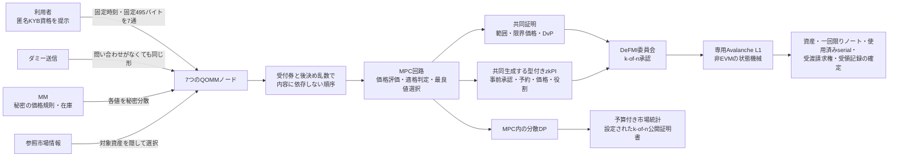
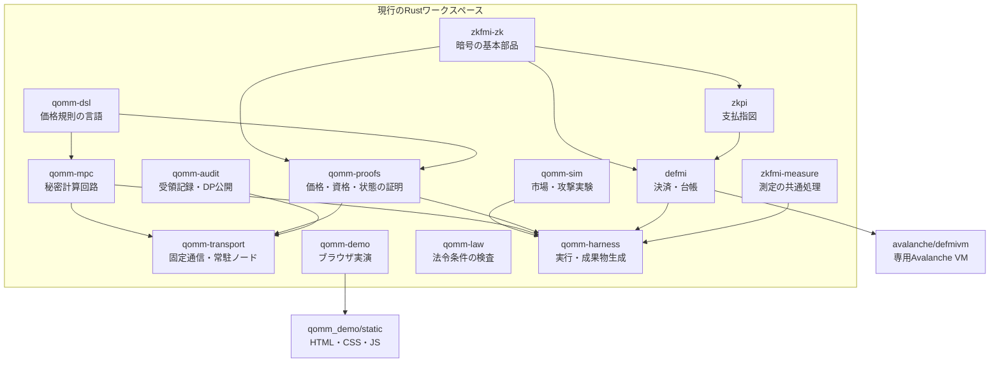
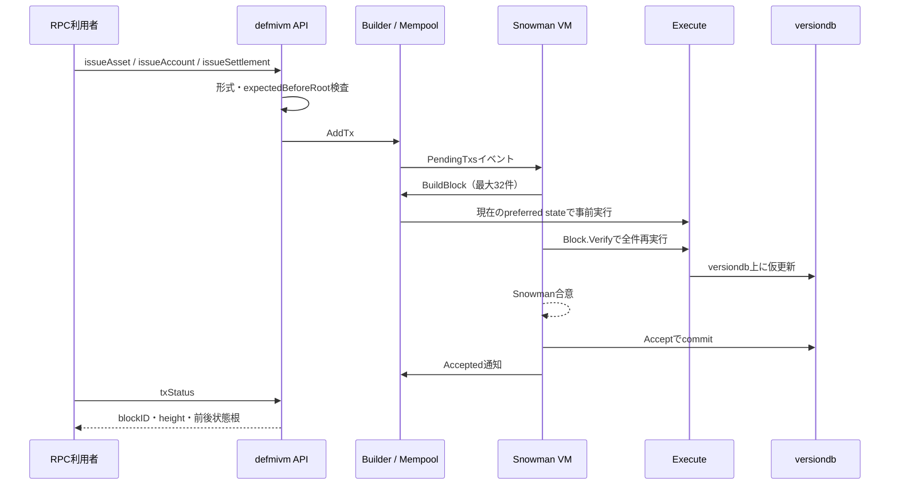

# QOMM・DeFMI・zkPI 全ソースコード技術解説

> 実行経路、秘密の境界、状態遷移、障害時の動作を、実装ファイルと対応づけて読むための資料

- 対象スナップショット: 2026-08-29（作業ツリー。P0〜P3、口座非開示ノート正本、外部KYB/CSD署名境界の統合後）
- 主対象: `rust/`、`avalanche/defmivm/`、`qomm_demo/static/`
- 補助測定: `solana/`、`stylus/`
- ファイル単位の索引: [SOURCE_FILE_INDEX.md](SOURCE_FILE_INDEX.md)

## 1. この資料の目的と範囲

この資料は、QOMMのコードを初めて読む開発者が、次をコード上で追えることを目的とする。

1. 利用者の問い合わせが、どこで秘密分散され、どこまで届くか。
2. マーケットメーカー（以下MM）の価格規則と在庫が、誰にも復元されずにどう評価されるか。
3. 最良価格、MMの状態更新、証明、決済指図がどう結びつくか。
4. DeFMIが複数資産の受渡しをどう検査し、原子的に更新するか。
5. 専用の非EVM Avalanche L1が何を再検査し、何を委員会に委ねるか。
6. 再送、再起動、二重使用、古い状態、ノード停止、不正な入力をどう処理するか。
7. 市場情報の公開、差分プライバシー、探り注文、MM収益性をどう実験するか。

対象は、このリポジトリが管理する第一者コードである。行数は生成中の文書や受入fixtureで変動するため、固定値を根拠にはしない。

次は対象外である。

- `rust/target/` などのビルド生成物
- `artifacts/` の測定結果そのもの（生成するコードは対象）
- `evm/lib/forge-std/` などの外部依存コード
- 外部のMP-SPDZ、AvalancheGo、Avalanche Network Runner本体
- 論文・スライドのTeX原稿そのもの

「実装済み」は、コードと自動試験または再現手順があるという意味である。外部KYB署名を受け取る入力境界と、CSD署名を別プロセスへ委ねる境界は実装した。一方、独立した暗号監査、7組織・7物理拠点での運用、物理HSM、実KYB/CSD事業者の本番API・契約、法的な決済最終性まで完了したという意味ではない。

## 2. まず全体を一枚で見る



この図は現在の**製品受入経路**を表す。常駐運用では役割ごとにサービスを分けるが、`run-full-qomm-l1.sh`は左端の事前承認からAvalanche確定までを一つの検証可能な走行に接続する。

| 実行境界 | 現在の入口 | 実際に行うこと | 製品受入での接続 |
|---|---|---|---|
| 事前承認・固定受付 | `serve_node`、`run_pretrade_reservations` | 相互TLS、匿名KYB、固定長帳票、内容非依存順序、Maker/Taker予約 | `PretradeAuthorityBundle`とDeFMI受領証でMPCへ接続 |
| 価格計算 | `seven_node_cluster`、`qomm_node_party` | 7者MP-SPDZでRFQ/RFM/RFS、買い/売り、Maker別予約を評価 | 秘密分散結果をノード別証明状態へ保存 |
| 共同証明・署名 | `serve_proof_party`、`frost_cluster` | 共同範囲・限界価格・DvP証明、MPC価格ジョブ承認、分散DKG、3-of-7 FROST | `SettlementHandoff`と型付きzkPIをDeFMIへ渡す |
| 決済・台帳 | `build_settlement_contexts`、`settle_finalized_batch`、DeFMI VM | 全証明の事前検査、受付順の原子的商品バッチ、口座を名指ししないノート・請求権のAvalanche確定 | 実MPC由来2 RFQを同一L1取引で確定済み |

`qomm-demo --engine mpc`は価格計算に実MP-SPDZを使い、成立後はRust製のメモリ内デモ台帳で資金・在庫を同時更新する。これは操作説明用の決済模型であり、Avalanche上の正本ではない。製品経路の再現入口は`avalanche/defmivm/scripts/run-full-qomm-l1.sh`である。

秘密と公開値の境界は次のとおりである。

| 種類 | 原則として秘密 | 公開または外部へ渡すもの |
|---|---|---|
| 利用者 | 問い合わせの有無、銘柄、数量、売買方向 | 固定長フレーム、匿名資格の正当性、法人単位ヌリファイア |
| MM | 価格規則の係数、在庫、個別の適格状態 | 規則の要約値、許容範囲を満たす証明、公開鍵 |
| 見積もり | 全MMの価格、敗者、内部比較結果 | 利用者が外せるマスク付き最良値、必要なら勝者だけへの情報 |
| 決済 | 数量・価格・資産の開示値、コミットメントの乱数 | 指図の要約値、期限、二重使用防止値、承認、状態根 |
| 市場統計 | 正確な未成立問い合わせ、正確な集計値 | DPノイズ後の値、使用した予算、公開証明書 |

## 3. 用語を平易に定義する

- **QOMM**: 問い合わせをMM本人へ配らず、複数ノードがMMの代理として秘密の価格規則を計算する仕組み。
- **MPC**: 複数ノードが値を分けて持ち、どの一台も元の値を見ないまま共同計算する方式。
- **秘密分散**: 一つの値を複数の断片に分け、規定数未満の断片からは元の値を復元できなくすること。
- **RFQ**: 一つの数量・方向に対し、一つの最良見積もりを返す問い合わせ。
- **RFM**: 買値と売値の双方を問い合わせる形。本実装では秘密方向を扱うため、RFQと内部計算量が近い。
- **RFS**: 同じ秘密問い合わせに対し、時間ごとに更新される価格列を返す形。
- **ZK証明**: 秘密の値自体を見せず、その値が条件を満たすことだけを検証可能にする証明。
- **コミットメント**: 値を後から変更できない形で封印する暗号学的な要約。ここではPedersenコミットメントを使う。
- **ヌリファイア**: 同じ資格・指図・ノートの二重使用を検出するための、一度だけ使える識別値。
- **zkPI**: zero-knowledge Payment Instruction。数量・価格・資産などをコミットした支払・受渡し指図。
- **DeFMI**: Decentralized Financial Market Infrastructure。現金、証券、投資信託、商品、カーボンクレジット等を登録・保有・移転・決済する分散型市場基盤。
- **DP**: 差分プライバシー。ある一法人のデータが入るか外れるかで公開結果が大きく変わらないよう、校正した乱数を加える方式。
- **状態根**: 資産、ノート、使用済みserial、請求権、保証枠、互換用口座などの正本状態を一定順序で要約した32バイト値。古い状態への再実行を検出する。
- **原子的決済**: 複数の受渡し脚を全部成功させるか、全部失敗させるかの二択にすること。

## 4. リポジトリの役割分担



13個のRustクレートは、暗号、回路、通信、決済、実験を意図的に分けている。`qomm-harness` は製品の取引処理ではなく、各部品を実行し、JSON成果物や文書を生成する再現基盤である。

## 5. 起動入口と利用目的

### 5.1 製品経路に近い入口

| 入口 | 役割 |
|---|---|
| `rust/qomm-transport/src/bin/serve_node.rs` | 一つの常駐ノードを起動する |
| `rust/qomm-transport/src/bin/seven_node_cluster.rs` | 7ノード、相互TLS、独立SQLite、再起動・再送を一括試験する |
| `rust/qomm-transport/src/bin/serve_qomm.rs` | MP-SPDZ回路を形ごとに一度コンパイルし、見積もり要求を受け続ける |
| `rust/qomm-demo/src/main.rs` | ブラウザ実演サーバーを起動する |
| `rust/zkpi/src/bin/verify.rs` | 標準入力のzkPIを解析・検証する独立CLI |
| `rust/qomm-law/src/bin/law.rs` | 法域・商品・日付を指定し、配備条件を検査する |

### 5.2 研究・性能測定の入口

`rust/qomm-harness/src/bin/` にある多数の実行ファイルが、回路性能、暗号証明、DP、攻撃、決済、Avalanche受入試験を個別に実行する。各入口の用途は付録に列挙する。

### 5.3 最短の動作確認

```bash
cd rust
cargo test --workspace --all-targets --all-features --release
```

MP-SPDZを使う経路は、外部のMP-SPDZを明示する。

```bash
MP_SPDZ_ROOT=/absolute/path/to/MP-SPDZ \
  ./rust/target/release/run_qomm \
  --n-mm 16 --mode rfq --n-parties 7 --threshold 2 --delay-ms 1 --repeats 5
```

専用Avalanche L1の実受入試験は次である。

```bash
AVALANCHEGO_PATH=/absolute/path/to/avalanchego \
AVALANCHE_NETWORK_RUNNER=/absolute/path/to/avalanche-network-runner \
  ./avalanche/defmivm/scripts/run-local-l1.sh
```

## 6. 一件の問い合わせを端から端まで追う

### 6.1 事前準備

取引前に、次の状態を登録する。

1. 外部KYB発行者が、法人参照要約、企業グループ要約、属性、保証水準、状態の期、有効期間へ署名する。QOMMはこれを検証して匿名資格集合へ変換する。
2. 各法人は、法人の秘密値から会場・期間ごとのヌリファイアを作れるようにする。
3. 各MMは、価格規則の形式、秘密係数、初期在庫、数量上限、期限、稼働状態を登録する。
4. 価格規則は承認済みDSLから生成され、実行回路の要約値と監査義務が同じ原本に結ばれる。
5. 7ノードは相互TLS鍵、フレーム認証鍵、受付券鍵、プログラム許可一覧を読み込む。
6. DeFMIは資産、CSD発行者、初期ノート、保証枠、委員会公開鍵、署名者の期、最小承認数を登録する。口座型は互換・比較用に残るが、全商品受入はノート型を使う。
7. Avalanche L1のgenesisは委員会構成を含み、実際のChain IDが承認署名の領域分離に使われる。

### 6.2 匿名KYBの提示

実装: `rust/qomm-transport/src/external_kyb.rs`、`rust/qomm-proofs/src/kyb.rs`

まず、外部事業者の`ExternalKybAssertion`を信頼アンカーで検証する。事業者、鍵、対象システム、署名、有効期間、最大寿命、保証水準、状態の期、取消し一覧をすべて確認する。`subject_digest`は個別法人の監査参照、`control_group_digest`は親子会社などを同じ探り・保証上限へまとめる保護単位であり、両者を混同しない。入力ファイルは非リンク・非書込み可能な通常ファイルとして安全に開き、検査した同じファイル記述子から読む。

その検証結果から匿名資格を発行する。利用者は、自分が署名済み登録簿のどれか一つの秘密鍵を知ることを、一対多の証明で示す。どの法人鍵か、生のLEIや事業者内IDは開示しない。同時に、会場・期間に結びついたスコープ・ヌリファイアを出す。

ノードは次を検査する。

- 登録簿の発行者署名
- 登録簿の期限と期番号
- 法域、法人種別、最低担保階層を表すコホート
- 問い合わせ文脈への結合
- 一対多証明
- 法人単位の回数、探り用ロット、DP予算

同じ支配グループが複数法人・複数ウォレットを使っても、外部発行者が同じ`control_group_digest`を署名した範囲では同じ保護単位になる。したがって制限単位はウォレットではない。ただし、どの法人を同じグループと認定するかは実KYB事業者と会場規則の責任であり、受入fixtureがその制度を代替しない。

### 6.3 固定時刻・固定長の送信

実装: `rust/qomm-transport/src/wire.rs`、`client.rs`、`relay.rs`

各時間枠で、利用者は問い合わせがある場合もない場合も、各ノードへ一通送る。

現在のwire version 4では、フレームは常に495バイトである。

```text
8   magic = QOMMWIRE
1   version
4   slot
2   node
448 payload
32  HMAC-SHA256
----------------
495 bytes
```

実問い合わせは、銘柄、数量、方向、時刻など最大14個の256ビット固定fieldへ正規化し、法
`2^255-19` の加法的秘密分散にする。ノードごとの448バイトpayloadには一つの断片と
乱数の詰め物を入れる。問い合わせがない場合も同じ構造のダミー断片を送る。

HMACは転送中の改変や別スロット・別ノードへの付け替えを検出する。HMACは内容を暗号化するものではないが、payload自体が秘密分散の一断片なので、単独ノードは元の問い合わせを得ない。

中継は同一スロットの到着を集めて順序を混ぜる。ただし、この中継は研究用の単純なTCP中継であり、匿名通信網やオニオンルーティングを実装したものではない。送信元IP等の通信メタデータ対策は配備層の責任である。

### 6.4 常駐ノードでの受付

実装: `rust/qomm-transport/src/node_service.rs`

常駐ノードの制御メッセージは常に4,096バイトである。先頭4バイトにJSON長、その後にJSON、残りに乱数を置く。TLS証明書の指紋を、次の役割に結びつける。

- `client`: フレーム提出だけ可能
- `coordinator`: スロット確定と計算開始が可能
- `observer`: 状態観測用。提出・計算開始は不可

ノードが受ける操作は4種類だけである。

| 操作 | 実行者 | 動作 |
|---|---|---|
| `health` | 認証済み主体 | 稼働状態を返す |
| `submit` | client | 固定長、ノード番号、スロット、HMAC、KYB、法人予算を検査して保存 |
| `close_slot` | coordinator | 全予定クライアントのフレームを確認し、受付順とバッチ要約を固定 |
| `compute` | coordinator | 確定済みスロットに対し、許可済みプログラムだけを実行 |

SQLiteは要求ID、要求本文の要約、スロット、フレーム、法人使用量、確定結果を保存する。同じ証明書・同じ要求ID・同じ本文なら保存済み応答を返す。同じ要求IDで本文が変われば拒否する。これは通信切断後の安全な再送を可能にし、二重受付を防ぐ。

予定されているクライアントのフレームが一つでも欠けると、スロット確定を拒否する。実問い合わせがあるクライアントだけを待つ方式にはしていないため、参加の有無による通信量の差を作らない。

### 6.5 内容に依存しない受付順

実装: `rust/qomm-transport/src/order.rs`

順序は次の二段階で決める。

1. 締切前に、受付局がスロット、法人ヌリファイア、要求要約へ署名した受付券を発行する。
2. 締切後に確定する乱数ビーコンを使い、受付済み項目の順序キーを計算する。

これにより、内容を読んで有利な要求を前へ出すこと、締切後に項目を差し替えること、同じ法人や券を重複登録することを拒否する。`BatchManifest` は全受付項目、乱数、順序、前マニフェストを要約する。`prove_omission` は、受付済み項目がバッチから落ちた証拠を作る。

この方式が防ぐのは、システム内部の内容依存順序である。利用者がネットワークへ到達する前の遅延、外部市場での先回り、委員会の全面停止までは消さない。

### 6.6 MMの秘密入力

実装: `rust/qomm-transport/src/roles.rs`、`binding.rs`、`rust/qomm-proofs/src/policy_audit.rs`

MMの各項目は、一つのMMから全ノードへShamir秘密分散する。

```text
asset, ask_level, spread, slope, invcoef,
inventory, maxqty, expiry, active, use_ref
```

一台のノードがMM一社分の規則を丸ごと持つ構成ではない。各ノードは全MMについて一断片ずつ持つ。

`roles.rs` は値域と回路の法が十分広いかを確認し、Shamir断片を作る。MMは各断片の本文に署名するため、ノードが別の値へ差し替えた場合に帰属を確認できる。ただし署名は差し替えを事前に不可能にするのではなく、検出可能にする。

`binding.rs` はPedersen/VSS型の係数コミットメントを作り、各ノードが受けた断片が同じ秘密多項式上にあることを確認する。`policy_audit.rs` は秘密係数が会場の許可範囲にあることをBulletproofs等で証明する。

### 6.7 MPC回路の生成と実行

実装: `rust/qomm-mpc/src/program.rs`、`inputs.rs`、`lib.rs`、`shim/qomm_spdz.cpp`

Rustの生成器は、公式MP-SPDZコンパイラへ渡す決定的な回路ソースを作る。回路の形は、MM数、ノード数、しきい値、資産数、問い合わせ数、モード、ビット幅、比較木の分岐数等で決まる。

価格は各MMについて次の形で計算する。

```text
anchored = ask_level                         （参照価格を使わない場合）
anchored = ask_level + selected_reference    （参照価格を使う場合）
depth    = slope × quantity
skew     = invcoef × inventory
ask      = anchored + depth + skew
bid      = anchored - spread - depth + skew
```

対象資産の参照価格は、資産IDを公開せず全候補から選ぶ。全MMの計算は同じ層で並列評価できる。

適格判定は、少なくとも次を含む。

- 資産一致
- 要求数量がMM上限以下
- 期限内
- 稼働中
- 実問い合わせフラグ

売買方向は秘密である。利用者が買う場合はask、売る場合は`-bid`を費用キーにし、常に最小値を選ぶ。

```text
cost_i = direction ? -bid_i : ask_i
key_i  = eligible_i ? pack(cost_i, maker_index_i) : LARGE
best   = argmin(key_0 ... key_M-1)
```

同価格時はMM番号を詰めたキーで決定的に解く。二分または多分岐のトーナメントを使うため、比較の深さは概ね`log(M)`である。

単一要求のRFQでは、最良キーに利用者の一回限りマスクを足して公開する。マスクを知る利用者だけが外せる。以前の特定ノードへの平文開示経路は使わない。

#### RFQ

秘密の一方向について、一つの最良キーを返す。

#### RFM

ask側とbid側の双方の最良キーを返す。内部で秘密方向を扱うため、RFQもask/bidの計算を行い、差は主に出力にある。

#### RFS

同じ問い合わせを複数時点で評価する。各時点で参照値を進め、勝者だけに次を適用する。

```text
won_i       = (key_i == best_key)
inventory_i = inventory_i + won_i × signed_quantity × is_real
```

次時点の価格が前時点の在庫に依存するため、RFSは時間方向には直列である。MM方向には並列である。

#### 現行生成回路の出力秘匿に関する制限

上記は目標とする出力境界である。`ProgramConfig::default()` は `public_check = true` であり、現在の実行入口には次の例外がある。

1. RFMはaskとbidの正確なキーを、既定値では全参加者へ `reveal()` する。
2. RFMのaskとbidには同じマスクを加えるため、公開検査を切っても二値の差は消えない。
3. RFSは各時点の最良キーを無条件でparty 0へ `reveal_to(0)` する。既定値ではさらに全参加者へ公開する。
4. 複数要求RFQは同じマスクを全要求で再利用するため、要求間のキー差が分かる。
5. `range_query` は範囲内の正確な社数を公開する。これはDP公開ではない。
6. `stop_after=price|direction|gates` は中間ベクトルをparty 0へ開く。これは計測専用であり、製品の秘匿経路ではない。

`qomm-gen` だけは `--no-public-check` を持つ。`run_qomm` と `serve_qomm` は既定の公開検査を無効化する引数または要求項目を持たない。このため、現状を「RFQ/RFM/RFSの全出力が利用者だけに秘匿される」とは評価しない。

### 6.8 入力の整合性検査

悪意あるノードや入力者が、監査用コミットメントと別の秘密値を回路へ渡すと証明と計算が分離する。入力検査を有効にした場合、実装はこれを二つの方法で検査する。

1. 各ノードの断片をVSSコミットメントに対して検査する。
2. 全入力後に乱数係数を引き、入力値の線形結合を開いて、登録済みコミットメントとの一致を確認する。

乱数を入力前に公開すると不正値を相殺できるため、チャレンジは入力確定後に生成する。集約検査とノード別検査を選べる。永続化された回路ワイヤから共同証明を作る経路は、`persistence.rs` と `qomm-proofs::threshold_quote` が担う。

汎用の`ProgramConfig::default()`は`input_check = false`であり、旧`serve_qomm`要求には切替項目がない。この制限は部分ベンチマーク入口に残る。製品受入は`seven_node_cluster`とノード別証明状態を使い、Maker/Taker mandate、予約受領証、入力コミットメント、共同証明を同じハンドオフへ結ぶ。

### 6.9 MP-SPDZ実行境界

`qomm-mpc/src/lib.rs` は、外部プロセスとしてだけでなく、C++の薄い接続層を介してMP-SPDZを組み込める。`build.rs` は `MP_SPDZ_ROOT` があるときだけ接続層をビルドする。未設定でも、回路生成やMP-SPDZ不要部分はビルドできる。

対応する主な方式は次である。

- malicious Shamir: 不正ノードを想定した本命経路
- semi-honest Shamir: 脅威モデルのコスト差を測る比較経路

C++接続層は、総時間だけでなく通信チャンネル別のラウンド数・送信量を構造化して返す。実行要求がMP-SPDZを指定した場合、実演層はシミュレーションへ勝手に置き換えない。

### 6.10 許可済みプログラムだけを実行する

実装: `rust/qomm-transport/src/executor.rs`

常駐ノードは任意のコマンドを受け付けない。管理者が登録した項目には、次が含まれる。

- 回路形状の要約値
- DSL原本から導いたソース要約値
- 実行ファイルのSHA-256
- 絶対パス
- 許可された引数の形
- タイムアウト

実行時は `O_NOFOLLOW` でファイルを開き、開いたファイル記述子から起動する。パス検査後のすり替えを避けるためである。環境変数を消し、許可された置換値だけを渡す。標準出力・標準エラーは内容を台帳へ丸ごと残さず、その要約値だけを返す。

確定していないスロットから計算を始めることはできない。

`serve_node`の`source_bound_executable_bytes()`は、許可実行境界そのものを試す固定ラッパーであり、価格計算器ではない。製品受入では、確定した受付帳票を`PretradeAuthorityBundle`へ運び、`seven_node_cluster`が`qomm_node_party`を通じて実MP-SPDZを起動する。したがって、旧ラッパーの役割と製品計算入口を混同しない。

`deploy/node.example.json`、`deploy/proof-party.example.json`、`deploy/approved-programs.example.json`は、現行のKYB・証明サービス・許可実行項目を含む例へ更新済みである。7ホスト用の配置と受入入口は`deploy/wan/`にある。

### 6.11 見積もりの正しさを証明する

実装: `rust/qomm-proofs/src/quote_proof.rs`、`threshold_quote.rs`

公開検証者が確認したい条件は次である。

1. 全MMが、公開された順序付き登録簿に含まれる。
2. 各MMの`depth = slope × quantity`が正しい。
3. 各MMの`skew = invcoef × inventory`が正しい。
4. 数量上限、期限、稼働フラグによる適格判定が正しい。
5. 不適格MMには番兵値`LARGE`が入る。
6. 公開された勝者キーは実際に登録候補の最小値である。
7. 同値時のMM番号による決定規則が守られる。

`Public` 文には、数量コミットメント、時刻、番兵値、方向、スロット、順序付きMM登録簿の要約、参照市場の要約が入る。MMを一社省略したり順序を変えると登録簿要約が変わり、同じ証明を再利用できない。

`threshold_sigma.rs`、`threshold_gadgets.rs`、`threshold_range.rs` は、秘密を一か所へ復元せず、各ノードの断片から通常の検証者が読める一つの証明を共同生成する。ノードごとのノンス寄与を先に封印し、部分応答を記録することで、不正な寄与の帰属も検査する。

共同価格証明には二つの入力経路がある。`deal_quote_shares()`で別途作った証人断片から組み立てる試験経路に加え、製品経路ではMP-SPDZが`persist_quote_proof_wires`で数量、九つの登録方針ワイヤ、適格判定、価格、順位キー、範囲分解をノード別に永続化する。各`proof_party`は自分のハンドオフだけを読み、`quote_statement_from_evaluations()`、二段階の関係証明、`quote_finalize`を経て一つの`QuoteProof`を共同生成する。旧形式の不足した`CircuitWires`だけを受ける`shares_from_circuit()`は意図的にエラーを返すが、これは製品経路が未実装という意味ではない。

資産IDは登録方針の`maker_asset`と問い合わせの`Public.asset`を比較し、不一致のMakerを適格集合から外す。参照市場を使うかどうかは登録済みの秘密bit `use_ref`で決まり、そのbit性を証明したうえで、`ask_level + use_ref × reference_price`を価格算術へ入れる。したがって、資産と参照値が価格計算へ入る結合も実装済みである。`market_digest`、資産、参照値、時刻、方向、登録簿要約は同じ証明文脈へ入る。残る外部境界は、参照値を供給する市場データ提供者の真正性・契約・停止時処理であり、価格証明回路の欠落ではない。

### 6.12 在庫状態の更新を証明する

実装: `rust/qomm-proofs/src/state_audit.rs`

各状態遷移は、前在庫コミットメント、約定量、方向、新在庫コミットメントを結ぶ。

```text
new_inventory + signed_fill - old_inventory = 0
```

さらに、秘密の在庫上限について、正負両方向で範囲内であることを証明する。証明列は直前の状態コミットメントに接続するため、都合のよい古い在庫から分岐できない。`verify_chain_bound` は、最初の旧状態が入力ディーラーの公開した値に結ばれていることまで確認する。

### 6.13 勝者だけへの固定長開示

実装: `rust/qomm-transport/src/selective_disclosure.rs`

利用者は、決済に必要な情報を勝者MMのX25519公開鍵だけで開けるよう暗号化する。

1. 一回限りのX25519鍵対を作る。
2. 勝者MM公開鍵との共有秘密を得る。
3. 問い合わせ文脈要約、見積もり要約、一回限り公開鍵をHKDF型のHMAC-SHA256導出へ入れる。
4. 1,024バイトへ乱数詰めした平文をChaCha20-Poly1305で暗号化する。
5. 一回限り公開鍵、nonce、文脈要約、見積もり要約を追加認証データにする。
6. 利用者が封筒全体へEd25519署名する。

暗号文長は常に1,040バイト（1,024バイト平文と16バイト認証タグ）である。受信MMは現在鍵と鍵更新の重複期間にある旧鍵を順に試す。非勝者は認証タグ検査に失敗して`None`を得る。復号後も、宛先MM ID、文脈、見積もり要約を再検査する。

### 6.14 zkPIを作る

実装: `rust/zkpi/`

MPC、Maker/Takerの承認、zkPI、DeFMIの関係は、[MPCからzkPIを作り、DeFMIで決済するまで](MPC_ZKPI_DEFMI_FLOW.md)で詳述する。

`Issuer::build()`は互換性用の単一生成器として残る。製品経路はこれだけに依存せず、ノード別の秘密分散値から共同範囲・限界価格・DvP証明を作り、`TypedInstruction`で事前承認、予約、MPC価格ジョブ要約、売買方向、DeFMI状態根を追加する。

zkPIの中心構造 `Instruction` は次を含む。

- 数量コミットメント
- 価格コミットメント
- 資産コミットメント
- 範囲証明。互換形式v1は数量・価格のBulletproof、製品形式v2は各MPCノードの秘密分散値から共同生成する数量・価格のしきい値範囲証明
- 支払者・受取者の会場別ハンドル
- 期限
- 32バイトnonce
- 互換形式v1の見積もりキー、または製品形式v2の完全Quote証明要約
- FROST定足数署名

署名文は `QOMM:ZKPI:v2`、会場・チェーン・レールの領域、全コミットメント、両ハンドル、期限、nonce、完全Quote証明要約を含む。製品形式v2は価格と勝者番号を含む旧見積もりキーを公開しない。別会場へ同じ指図を持ち込めない。

ヌリファイアはnonceと両ハンドルから導く。会場は、期限、最大有効期間、支払者と受取者の相違、範囲証明、署名、未使用ヌリファイアを検査する。

製品経路の`ExecutionContext`はさらに、操作種別（予約・消費・解除・決済）、Maker/Takerの役割と方向、両予約ID・通し番号、RFQヌリファイア、両mandate、予約受領証、MPC価格ジョブ要約、限界価格関係証明、参照市場文、更新前状態根を持つ。第二の3-of-7署名が旧`Instruction`とこの文脈を結ぶ。

FROST鍵片は`proof_party`の暗号化状態から外へ出ない。予約用zkPIも`StdioFrostCluster`または相互TLSの`serve_proof_party`を使い、各ノードが署名済みMaker/Taker mandateを独立検査してから署名する。

実WANの初期化は`provision_frost_cluster`が行う。調整役は公開情報と宛先別暗号文だけを中継し、
各ノードは確認済み参加者表、第1段階、第2段階を順に暗号化保存する。このため、全ノードの
第2段階が揃う前に調整役または一部ノードが停止しても、同じ初期化IDから再開できる。
状態形式V2は、完全Quote証明の有無、証明幅、しきい値、DeFMI検査鍵をFROST鍵片へ結び、
安全設定だけを変えた長期鍵再利用を起動時に拒否する。

`handles.rs` は本人の種と会場名から会場別ハンドルを導く。同一会場では安定し、別会場間では直接結合できない。

固定バイナリ形式は、magic `QOMMZKPI`、形式版、5個の圧縮点、期限、nonce、見積もりキー、署名、範囲コミットメント、長さ付き証明からなる。未知の版、不正な点、不正な署名形式、途中切れ、末尾余りを拒否する。

注意: バイナリ形式の `VERSION = 1` と署名文の `QOMM:ZKPI:v2` は別の版である。前者は配送形式、後者は暗号文の意味を表す。

### 6.15 DeFMIで指図を検査する

実装: `rust/defmi/src/settlement.rs`、`rust/defmi/src/note_chain.rs`、`rust/defmi/src/product.rs`

基礎となる口座型DvPでは、zkPIの数量と証券脚を「生成元が違っても同じ値」という証明で結ぶ。現金脚については、次の積関係を証明する。

```text
cash_value = quantity × price
```

全商品受入は、同じ算術関係を口座更新ではなく、予約ノートの消費と受渡・返却請求権の生成へ投影する。DeFMIのRust側は平文の数量・価格を復元せず、次を確認する。

- 各予約ノートがMaker/Takerの署名済みmandate、役割、売買方向、保証枠holdへ結ばれる。
- 証券側の受渡額がzkPI数量と等しい。
- 現金側の受渡額が`quantity × price`と等しい。
- 各予約について、受渡額と返却額の和が予約額と等しい。
- 受渡・返却の金額コミットメントが非負の範囲内にある。
- 勝者Makerの予約だけを選び、Takerの限界価格を満たす。
- 証券脚と現金脚が同じRFQ、価格ジョブ、状態根、指図へ結ばれる。
- 予約ノートの使用済みserial、RFQヌリファイア、指図ヌリファイアが未使用である。

全検査が成功してから、両方の予約ノートを同じL1状態遷移で消費し、相手向け受渡請求権と元保有者向け返却請求権を作る。片方だけを先に確定しない。

`build_package()`は数式検査用の単一証明者経路として残る。製品受入は、7プロセスが各自の秘密分散値から作る`ThresholdDvpPackage`、zkPIの秘密資産タグをDeFMI資産IDへ結ぶ`AssetLinkProof`、検証済み予約をノート正本へ写す`VerifiedDelegatedNoteSettlementProjection`を使う。調整役はMaker/Taker双方の残高秘密、数量、価格、FROST鍵片を復元しない。

決済時に作る`NoteClaim`はすでに最終的な受渡権または返却権である。後の`MaterializeNoteClaim`は、一回限りの受取人秘密を証明して同じ資産ID・同じ金額コミットメントの通常ノートへ変えるだけであり、再同意、再約定、取消しではない。

### 6.16 DeFMIの永続状態機械

実装: `rust/defmi/src/facility.rs`、`rust/defmi/src/note_chain.rs`、`avalanche/defmivm/state/`

`facility.rs`のチェーン中立なSQLite投影は、口座型・保証枠の比較試験とL1橋渡しに次を保存する。

```text
assets                 資産ID、コード、種類、小数桁、約款要約、稼働状態
accounts               ハンドル、資産ID、残高コミットメント、順序番号
guarantors             CCP・銀行・自己保証の定義とリスク方針
credit_facilities      法人・保証主体・レール単位の秘密保証枠
credit_holds           RFQまたはMaker規則に結んだ短期予約
reservation_bindings   mandate、役割、受付順、予約受領証との結合
admission_batches      7ノード署名済みの実RFQ・ダミー全レーン
nullifiers             使用済み指図、期限、遷移文
receipts               操作ID、遷移文、前後状態根、署名済み受領記録
metadata               現在状態根、直前受領記録要約
```

一方、`run-full-qomm-l1.sh`の全商品受入では、専用Avalanche L1が正本であり、`state_database: null`である。口座の代わりに次を合意状態へ持つ。

```text
notes                  一回限り公開点、金額コミットメント、暗号化開示値、lock
note_serials           使用済み入力または予約ノートの再利用防止値
note_reservations      hold、予約ノート、委任要約、active/consumed
note_claims            delivery/refund、金額、受取人コミットメント、状態
csd_issuers            発行鍵、許可資産、有効期間、active/suspended/revoked
guarantors             CCP・銀行・自己保証
credit_facilities      支配グループ・保証主体・レール単位の保証枠
credit_holds           Maker規則または一回限りRFQの予約
reservation_bindings   mandate、役割、受付順、予約受領証との結合
admission_batches      実RFQとダミーを含む全受付レーン
nullifiers/operations  指図・RFQ・操作の再利用防止
receipts               前後状態根と受理ブロック
```

資産種類は、現金、証券、投資信託、商品、カーボン、その他を扱う。株式専用ではない。CSD発行は外部署名プロセスのEd25519署名を要求し、発行時刻にその発行者が有効・稼働中で、対象資産を許可していることをRustとVMの双方で検査する。

`ProductNoteSettlementOrder`は、受付epoch・sequence、Maker/Taker予約の消費、型付きzkPI、MPC価格ジョブ要約、限界価格・資産結合・DvP証明、保証枠遷移、予約ノート、受渡・返却請求権を一つの正規化文へ結ぶ。`ProductNoteSettlementBatch`は独立する複数RFQを受付順に並べ、一つの原子的状態遷移にする。口座型の`ProductSettlementOrder`と`ProductSettlementBatch`も互換・比較用に残る。

委員会承認は、署名者期、会場・チェーン領域、**現在の更新前状態根**、遷移文を含む。署名者IDの重複、未登録鍵、同じ鍵の複数ID利用、承認数不足を拒否する。

SQLite口座型は`BEGIN IMMEDIATE`、Avalancheノート型は`versiondb`上のブロック原子性を使う。ノート型商品決済は次の順で処理する。

1. 操作ID、指図ヌリファイア、RFQヌリファイアが未使用か確認する。
2. 現在状態根を再計算し、k-of-n承認が遷移文・Chain ID・現在根へ結ばれているか確認する。
3. 期限、受付順、Maker/Takerの方向と予約bind、保証主体・支配グループ・資産レールを確認する。
4. 保証枠holdと予約ノートがactiveで、同じ予約額・資産・委任要約を持つか確認する。
5. DvP証明要約と、受渡・返却請求権のコミットメントが消費額・返却額に一致するか確認する。
6. 予約ノート由来serialと全claim IDが未使用か確認する。
7. 全件を先にprepareし、一件でも失敗すれば何も適用しない。
8. 保証枠とholdを更新し、予約をconsumedにし、serial、請求権、ヌリファイア、操作記録を挿入する。
9. 新状態根と受領記録を作り、AvalancheブロックのAcceptで全部を一度にcommitする。

同じ操作IDで別の文を送る、同じserialまたはヌリファイアを使う、古い保証枠・予約状態を使う、別資産を混ぜる、停止資産や停止CSD発行者を使う、といった要求は拒否する。

`product.rs`と`FacilityAvalancheBridge`は、KYB、mandate、型付きzkPI、価格限界、資産結合、共同DvP、保証枠関係証明を送信前に検査する。さらに専用VMの各Avalanche検証者も、型付きzkPIとFROST署名、完全Quote証明、価格限界証明、数量×価格のDvP証明、予約残額、資産結合証明を証明バイト列から再検証する。その後に、実Chain ID、更新前状態根、3-of-7承認、状態機械の不変条件を検査して正本を更新する。送信側の事前検査は早期失敗のためであり、検証者側の検査を省略する信頼境界ではない。

### 6.17 専用Avalanche L1へ送る

実装: `rust/defmi/src/avalanche.rs`、`avalanche/defmivm/`

RustのRPCクライアントは、資産、口座互換経路、CSD発行者、ノート発行、保証主体、保証枠、受付バッチ、ノート予約・解除、通常/商品ノート決済、原子的商品バッチ、請求権のノート化をJSON-RPCへ変換する。HTTPSを原則とし、平文HTTPは明示したlocalhost試験だけ許す。応答ID、HTTP状態、JSON-RPCエラー、最大1 MiB、時間切れを検査する。

橋渡しは次の順序を採る。

1. L1へ遷移を提出する。
2. `txStatus` を照会し、合意済み受領記録を待つ。
3. 受領記録の遷移文と更新前状態根を検査する。
4. 同じ遷移をローカルDeFMI投影へ適用する。
5. L1とローカル投影の更新後状態根が完全一致することを確認する。

この順序により、ローカルだけ先に進みL1で拒否される状態を避ける。

商品バッチでは`submit_product_threshold_batch`がL1受理だけを行い、`settle_product_threshold_batch`が同じ決定的取引を再送してローカルへ投影できる。L1確定直後に停止しても、再試行で同じ取引IDを確認し、二重決済を作らず投影を復旧する。

### 6.18 Avalanche VM内部の処理

専用VMはEVM、Solidity、EVMプリコンパイルを使わない。AvalancheGoの`ChainVM`を直接実装する。

RPCChainVMのHTTP接続は二経路ある。通常のHTTP/1 JSON-RPCは`HandleSimple`で固定長の要求・応答を渡す。AvalancheGoがHTTP/2要求に使う`Handle`では、AvalancheGo側の一時reader/response-writer gRPCサービスをRustの`HttpBridge`が呼び、同じ本文上限とJSON-RPC処理へ接続する。QOMMにはWebSocket APIがないため、`Upgrade`要求だけは426で明示的に拒否する。公式v1.14.2の二つのcallback schemaとBSDライセンスは限定fork内に固定している。



VMの取引は、資産・互換口座だけでなく、CSD発行者、ノート発行、請求権のノート化、CCP/銀行/自己保証、保証枠、受付委員会と受付レーン、口座型/ノート型の予約・解除・決済、商品バッチを型ごとに分ける。全商品受入が実際に使う中心型は`RegisterCSDIssuer`、`IssueNote`、`ReserveNoteProduct`、`SettleNoteProductBatch`、`MaterializeNoteClaim`である。

`Builder` は受付順のメモリプールから最大32件を選ぶ。preferred blockの版管理状態に対して事前検査し、不正取引を理由付きで除外する。拒否理由の記憶数は4,096件に制限する。

ブロック検証は、親ID、高さ、時刻、空でないことを確認し、全取引を版管理DBへ適用する。Acceptで初めて基礎DBへcommitする。Rejectされたブロックの取引は再投入する。

決済取引は、Chain IDを含む領域、現在状態根、委員会承認、期限、操作ID、ヌリファイア、資産レール、保証枠hold、予約ノート、使用済みserial、受渡・返却請求権を検査する。状態根は資産、CSD発行者、ノート、serial、claim、保証枠、受付、予約、互換用口座、ヌリファイアを一定順序で読み、正規化して計算する。

各遷移記録は、取引ID、遷移文、更新前根、更新後根、ブロックID、高さを持つ。再起動時は最後に受理したブロックと永続DBから同じ状態を復元する。

Avalancheの高速状態同期もRust VMに実装した。状態要約はnetwork ID、chain ID、genesis、確定block、状態根、snapshot要約、Merkle根を結び、最大512 KiBの独立検証可能な断片として転送する。新しい検証者は全断片、Merkle根、snapshot全体、block ID、状態根が一致するまで何も導入せず、途中状態から再開できる。改変・余分なバイト・別chain・不完全断片の拒否は単体試験済みである。実5検証者での大規模snapshot参加時間の測定は、機能実装とは別の運用実測として残る。

### 6.19 受領記録とノード責任

実装: `rust/qomm-audit/src/receipts.rs`

固定スロットごとに、問い合わせの有無にかかわらず、ノードは前状態、新状態、結果、MM集合、市場情報、締切へ署名する。`AuditLedger` は次を検出する。

- 不正署名
- 同一ノードの二重署名
- 登録MMの省略
- 古い参照市場
- 誤った締切
- 古い前状態
- 必要な受領記録の欠落
- 状態列の分岐

必要数が同じ遷移へ同意したときだけ状態を進める。`BondLedger` は検出された故障種別に応じ、設定済み固定額を保証金から差し引く。これは法的な没収制度そのものではなく、プロトコルの責任帰属を実行可能にしたモデルである。

固定周期で空スロットにも記録を作るのは、異議申立てや失敗記録の発生自体から実問い合わせの有無が漏れることを避けるためである。

### 6.20 市場統計をDPで公開する

実装: `rust/qomm-audit/src/distributed_dp.rs`、`publication.rs`

正確な個別価格と市場向け統計は別経路にする。個別価格は利用者だけへ返し、市場統計は法人単位で寄与上限を設け、MPC内でノイズを加えてから公開する。

`DpMechanism` は、整数値向けの有限台・離散Laplace分布を、64ビット一様乱数と量子化CDFで表す。有限端では確率質量を端点へ畳み込む。公開証明書には、主張するεだけでなく、有限台による実際の`delta`を計算して入れる。丸め誤差の指標とプライバシー保証の`delta`を混同しない。

MPCプログラムは次を行う。

1. 各ノードが正確統計の断片を入力する。
2. ノードの乱数寄与から共有64ビット乱数を作る。
3. 共有状態のまま離散ノイズを標本化する。
4. 正確統計ではなく、合計にノイズを足した値だけを公開する。
5. 前予算、消費ε、後予算の遷移を検査する。

`PublicationStatement` は、会場、期、対象スロット、集計規則、仕組み、秘密入力要約、MPC記録要約、出力、ε、delta、前後予算、前公開証明書を結ぶ。異なるノードIDによる規定数のEd25519署名が必要である。

DPを使わない運用も成立する。その場合は市場向け公開を行わず、正確な個別価格と成立取引だけを扱う。DPはMPCの正しさや先回り防止に必要な部品ではなく、市場統計を継続公開したい場合の追加層である。

## 7. 暗号部品を下から読む

### 7.1 `zkfmi-zk`

`zkfmi-zk` は、上位プロトコルが共通して使うRistretto255上の部品を持つ。

- `pedersen.rs`: Bulletproofsと同じ生成元を使うPedersenコミットメント。資産ごとの値生成元も導出する。
- `sigma.rs`: 開示証明、生成元またぎ同値証明、積証明、線形関係、0/1証明、バッチ検証。
- `range.rs`: 8/16/32/64ビットのBulletproofs。範囲外入力を証明前に拒否し、複数値を2の冪へ埋めて集約する。
- `bitrange.rs`: 任意幅のビット分解型範囲証明。各ビットが0/1であることと、重み付き和が元コミットメントへ一致することを証明する。
- `or_dleq.rs`: どれか一つの離散対数を知る一対多OR証明。
- `oneofmany.rs`: Groth–Kohlweiss型の対数サイズ一対多証明。
- `adaptor.rs`: 一方の署名完成から秘密を抽出し、他方の支払を完成させるPvP用アダプター署名。
- `shamir.rs`: Shamir再構成と、誤った断片の位置を求めるBerlekamp–Welch復号。

曲線演算、Bulletproofs、FROSTは外部クレートを使う。一方、σ証明の組合せと一対多証明は自前実装であり、独立監査済みではない。

### 7.2 共同証明の安全境界

ノードが共同証明を作る場合、秘密値を復元しないことだけでは不十分である。同じノンスを再利用すると秘密断片が漏れるため、各ノードのノンス寄与を一回ごとに生成・封印し、部分応答の記録と結ぶ。規定数未満のノードだけでは証明を完成できない。

回路の法とRistrettoスカラー体が違う場合、単純に断片を移すと同じ整数を表さない。`check_circuit_field` は法と値域の条件を検査し、`shares_from_circuit` が許可された範囲だけ変換する。

## 8. 価格規則DSL

実装: `rust/qomm-dsl/`

任意のプログラムを秘密のまま監査するのは現実的でないため、価格規則を小さな全域言語へ制限する。

宣言は次の3種類である。

```text
param  秘密だが問い合わせ間で固定する係数
state  取引ごとに更新する秘密状態
input  利用者または参照市場から入る値
```

各値には上下限が必須である。式は整数の加減乗、比較、論理積、`min`、`max`、`clamp`、符号選択等に限る。ループ、配列添字、属性参照、除算、浮動小数点、外部通信はない。

`wallet`、`address`、`entity`、`user`、`client`、`counterparty`、`kyc_id` 等の本人識別につながる名前は拒否する。これは文字列検査だけで万能な非差別性を証明するものではないが、許可入力を構造的に限定する。

DSLコンパイラ自体は一つの原本から次を出す。

1. 区間演算で求めた全中間値の範囲
2. オーバーフローしない必要ビット幅
3. 秘密値同士の乗算次数
4. MPC回路ソース
5. ZK証明で満たすべき範囲・積・ビット・開示の義務
6. 原本と回路形状を結ぶ登録要約

宣言したのに使わない値も拒否する。

現行のQOMM回路は、`qomm-mpc/src/program.rs`が価格規則の抽象構文木から実行代入文を生成し、DSL原本のSHA-256を回路へ埋め込む。`CircuitRegistry::approve()`と実行許可登録簿は、承認済みDSLからRustで回路を再生成し、原本、設定、生成ソースが完全一致する場合だけ受理する。したがって、最初から別のDSLと価格回路を組にして承認する経路も、登録後にソースや実行ファイルを差し替える経路も拒否する。`qomm-mpc/tests/policy_binding.rs`と`qomm-transport/tests/executor.rs`がこの結合を検査する。

## 9. DeFMIの追加レール

### 9.1 口座台帳 `ledger.rs`

口座残高をコミットメントで保持し、移転前にprepare、全条件成立後にcommit、時間切れ時にunwindする。発行は発行権限の署名を必要とする。

### 9.2 ノート台帳 `notes.rs`

口座ハンドルを毎回平文で指定すると取引関係が見える。ノート方式は保有をUTXO型のノートにし、どのノートを使ったかを一対多証明で隠す。

受取人の秘密からシリアルを作り、同じノートに別シリアルを作れないことを証明する。閲覧鍵は受取候補を走査でき、支出鍵だけが使用できる。匿名集合は最近のノートや指定方針から作る。使用済みシリアル集合が二重使用を拒否する。

`note_chain.rs`は、このローカル暗号表現を専用Avalanche VMへ投影する正規形式を持つ。正本へ保存するのは一回限り公開点、金額コミットメント、暗号化開示値、匿名集合根、serial、lock、証明要約であり、安定した所有者IDや入力indexではない。`CsdIssuerDefinition`と`NoteIssuance`は、発行者公開鍵、許可資産、有効期間、稼働状態、個別ノート署名を結ぶ。

### 9.3 ノート型DvP `note_settlement.rs`

証券脚と現金脚の双方を、入力ノート、受取ノート、釣銭ノートで構成する。リング証明、範囲証明、zkPIとの値結合を全部確認した後、両ノート台帳を更新する。

全商品経路では、事前予約時に支出可能ノートから`hold_id`へロックした予約ノートと釣銭を作る。約定時はそのロック済みノートを委任に従って消費し、相手向け`delivery`と元保有者向け`refund`の一回限り請求権を作る。請求権が作られた時点がDvPの最終確定であり、後のノート化にMaker/Takerの取引署名は不要である。

### 9.4 ネッティング `netting.rs`

次のBIS型を扱う。

- Model 1: 証券gross / 現金gross
- Model 2: 証券gross / 現金net
- Model 3: 証券net / 現金net

gross方式は各指図を検査する。net方式は参加者別の差額を加算し、決済サイクル全体が閉じることと、必要残高を満たすことを証明する。サイクル単位の宣誓で、多数指図を一つの承認へまとめられる。

### 9.5 CCPと清算参加者 `ccp.rs`

当事者が署名した債務を清算機関へ更改し、元当事者間の債務を清算機関対参加者の債務へ置き換える。清算参加者ごとの担保・基金・追加負担のウォーターフォールを分離し、ある参加者の破綻を別参加者の帳簿へ混ぜない。

### 9.6 与信とウォーターフォール `credit.rs`

担保価値へヘアカットを適用し、秘密の信用枠をコミットする。各階層は、前階層が残っている間は次階層から引けないことを積制約で示す。`TrancheBook` は同じ解決IDの再適用を拒否する。

### 9.7 PvP `pvp.rs`

二つの異なる台帳間でpayment-versus-paymentを行う。一方がアダプター署名を完成すると秘密が抽出でき、他方の署名も完成する。期限までに進まなければprepare状態を解放する。二台帳間なので瞬間的な同時commitではなく、暗号学的に相手の完了可能性を結ぶ方式である。

### 9.8 照合 `reconcile.rs` と原簿 `register.rs`

内部コミットメント合計と、権威ある原簿の総数を同値証明で比較する。差がある場合は、範囲を二分しながらどの区間に差異があるかを探せる。個別位置の開示は照合予算として記録する。

原簿CSVは形式を厳格に解析し、発行者署名、総数のみの原簿か個別位置を持つ原簿かを区別する。

### 9.9 閲覧権 `viewing.rs`

商品、期間、監査目的ごとに派生アドレスを変える。閲覧許可は対象範囲と期限へ署名する。暗号学的な失効は署名の取り消しではなく、新しい範囲へ資産を移すことで行う。使用事実の限定開示と、範囲の計画外到着も検出する。

### 9.10 審査集合 `vetting.rs`

参加者ハンドルを固定人数の群へ入れ、一対多証明でどれかに属することだけを示す。群の大きさを一定にし、毎回異なる小集合を問い合わせて交差から本人を絞る攻撃を抑える。

## 10. 市場・攻撃・経済実験

実装: `rust/qomm-sim/`

### 10.1 市場状態

価格はtick、数量はlotの整数で扱う。MM価格式はMPC回路と同じ意味にする。乱数、浮動小数点和、丸めは過去成果物から固定した数値契約に従い、Rust実装の変更で結果が意図せず動かないことを検査する。

### 10.2 比較する方式

通常RFQ/RFM/RFSとQOMM版を、次の公開方式と組み合わせる。

- A: 未成立問い合わせの市場公開なし
- B: しきい値だけをZKで公開
- C: 法人単位で寄与を切り、DPノイズ後の統計を公開

成立取引は全方式で外部から見えるものとして扱う。測る漏洩は主に「ある法人が問い合わせたが成立しなかったか」である。

### 10.3 攻撃者

`attackers.rs` は、受動観測、時間窓のずらし、能動的な探り、取引前情報、複数ウォレット共謀、外部取引履歴との結合を実装する。結果はAUCと低い誤検知率での検出率等で比較する。

### 10.4 DP監査

`audit.rs` は、一法人の記録がある世界とない世界を作り、公開値からどちらかを当てる二世界実験を行う。Clopper–Pearson区間と多重比較補正を使い、主張εが実験上破られていないかを見る。実験で破れなかったことは数学的証明の代替ではなく、実装誤りの検出手段である。

### 10.5 有料の範囲問い合わせ

`queries.rs` は、価格帯、ブロック範囲、集計対象を明示した市場統計問い合わせを扱う。感度、料金、法人予算を計算し、同じデータを細かく反復して推測する費用を外部化する。

### 10.6 実データ

`tapes.rs` はUniswapXやBybitの取引テープを読み込む。観測できないMM内部規則は生成するため、実データ再生は「実際の注文流・価格変化を使う」比較であって、過去市場を完全復元するものではない。

## 11. ブラウザ実演

実装: `rust/qomm-demo/`、`qomm_demo/static/`、`qomm_demo/react-flow/`

### 11.1 サーバー

`main.rs` が部屋を作り、HTTPとWebSocketサーバーを起動する。役割は利用者、MM、計算ノード、観測者である。空席はbotが担当し、人が席を取るとbotが外れる。

各WebSocket接続へ送る状態はサーバー側で役割別に投影する。ブラウザで表示を隠すだけではなく、他の役割の秘密データをJSONへ含めない。

### 11.2 計算エンジン

- `sim`: 実際の秘密分散と復元・不正断片検出をRust内で実演するが、本番MPCではない。
- `mpc`: 外部MP-SPDZを呼び、平文参照値と一致することを確認する。MP-SPDZが使えなければ失敗し、`sim`へ自動代替しない。

不正ノード動作として、積の偽装、開示値の偽装、入力断片の偽装、離脱、オフラインを注入できる。結果は「正しく完了」「不正を検出して拒否」「人数不足で中止」を区別する。

### 11.3 フロントエンド

- `index.html`: ロビー、役割選択、取引フェーズ、各役割の表示領域
- `demo.js`: WebSocket接続、再接続、席操作、注文、指値、MM設定、ノード故障注入、役割別状態の描画
- `demo.css`: デスクトップ・狭幅の配置、状態色、パネル、表、操作部品
- `react-flow/src/main.tsx`: 注文者、4社のMaker、7台のMPCノード、価格照合、zkPI検証、DeFMI台帳をReact Flowのノードと取引経路として描く。ノード編集機能は持たず、移動、拡大、縮小だけを許す
- `react-flow/src/network.css`: 役割色、現在の処理だけを動かす線、予約・資金・在庫の表示、狭幅時の可読性を定義する

Rustが役割別に作ったJSONを`demo.js`が表示用のノードと線へ変換し、React Flowへ渡す。React側は取引判断、残高計算、照合、決済を行わない。注文者とMakerから7台への線は秘密分散値、7台から価格照合への線はMPC出力、価格照合からzkPI検証とDeFMI台帳への線は証明と台帳更新を表す。現在の段階だけ線と粒子を動かし、処理済み、未開始、拒否を別の表示にする。

残高、予約、価格規則、問い合わせ、照合、決済はブラウザ内で計算せず、Rustサーバーの状態だけを操作する。Takerは問い合わせ送信時に買付資金または売却在庫を予約する。Makerは価格規則の提出時に最大提示数量分の売却在庫と買付資金を事前予約する。成立時は追加署名を待たず両脚を一つの遷移で更新し、カバー、価格不成立、中止、適格Makerなしでは資産を動かさない。

役割別の送信内容もRust側で制限する。Takerは自分の残高・予約・問い合わせ・結果だけ、Makerは自分の残高・価格規則・事前予約・成立した自分の取引だけ、MPCノードは自分の断片・計算段階・証明結果だけを受け取る。MPCノードは資産を保管せず、残高、平文問い合わせ、他Makerの規則を受け取らない。観測者画面だけが説明用に全体を表示する。

`sim`と単体`mpc`の画面残高はRust製のメモリ内模型である。Dockerの`distributed`構成では、法人モジュールから読み取った資金・在庫上限で画面投影を初期化し、実際の7台のMPC、型付きzkPI、5検証者のAvalanche DeFMIへ接続する。最終的な正本はDeFMIの口座非開示ノート、予約、serial、受渡請求権であり、ブラウザの投影はその操作を説明する表示である。Gateway再起動時には法人所有キューの署名済み要求から未完了予約を復元し、期限切れなら元のサービス版の署名とDeFMI正本を照合して自動解放する。現在のMPCサービスIDだけを要求して過去版の予約を残置しない。

## 12. 鍵管理

実装: `rust/qomm-transport/src/key_management.rs`

秘密鍵保存形式は次である。

```text
magic QOMMKEY1
16-byte random salt
12-byte random nonce
AES-256-GCM ciphertext + 16-byte tag
```

パスフレーズからscrypt（N=`2^15`, r=8, p=1、メモリ上限64 MiB）で256ビット鍵を導く。保存ファイルとロックファイルは0600を強制する。一時ファイルへ書き、fsync、rename、親ディレクトリfsyncの順で原子的に更新する。

Ed25519とX25519を用途名ごとに生成する。新鍵生成時は旧active鍵をretiredにし、更新の重複期間中は復号等に使える。失効は理由と時刻を記録する。公開鍵一覧は世代番号、用途、期限、状態を持ち、管理署名鍵で署名する。

相互TLS用にはローカルCAと短命証明書を発行する。ファイル暗号化はHSMの代替ではない。本番では秘密鍵生成・利用をHSMまたは同等の鍵管理境界へ移す必要がある。

`external_signer.rs`は、CSD発行署名を固定された外部コマンドへ渡す境界である。DeFMIは領域分離済みメッセージだけを送り、固定公開鍵で返却署名を検査し、秘密鍵バイトを受け取らない。実行ファイルは絶対パス、実行可能な通常ファイル、group/other非書込みを要求する。要求64 KiB、直列化後96 KiB、応答4 KiBの上限を持ち、標準入力を読まない子や標準出力を詰まらせる子も監督時間切れで停止・回収する。受入の補助プロセスはこの分離を検査するためのもので、物理HSMを検証した証拠ではない。

## 13. 法令条件をコード化する層

実装: `rust/qomm-law/`

`.law` ファイルは、法域、商品、要件、根拠条文、施行日、最終確認日、再確認間隔、実装証拠、配備を結ぶ。

コンパイラは次を拒否する。

- 回答のない要件
- 根拠条文のない判断
- 実装証拠のない義務
- 対象日前に未施行の条文
- 確認期限を過ぎた条文
- 対象法域・商品の配備定義欠落

出力は根拠付きMarkdownである。これは法的助言や最新法令の自動取得ではない。入力した法令情報が古いときに黙って成功しないための仕組みである。

## 14. 実験と成果物の再現

### 14.1 `qomm-harness`

各バイナリは、入力、実行環境、繰返し数、結果、誤差、ホスト識別をJSONへ出す。外部プログラムが見つからない場合は、入力ファイル欠落と区別したエラーを返す。

`research_run.rs` は、研究契約、実験manifest、成果物、追記専用台帳をSHA-256で結ぶ。契約にない目的変更、同じ棄却実験の名前だけを変えた再実行、確証条件を満たさない昇格を拒否する。

### 14.2 `zkfmi-measure`

時間測定は、標本数、平均、標本標準偏差、中央値、最小、最大を持つ。証明長やコンパイルラウンド数のような決定値は`Exact`として区別する。過去成果物から固定した浮動小数点和、乱数、丸めの契約を用意し、実装変更と数値処理変更を区別する。

### 14.3 成果物台帳

`artifacts/MANIFEST.json` は成果物のSHA-256を記録する。`manifest --check` は、論文や資料が参照する結果が後から変わっていないかを検査する。文書生成器 `build_audit_doc` と `build_defmi_doc` は、手書きの数値ではなく成果物からMarkdownを再生成する。

## 15. 障害・攻撃ごとの動作

| 事象 | 検出箇所 | 結果 |
|---|---|---|
| フレーム長が違う | `wire.rs` / `node_service.rs` | 受付拒否 |
| フレーム改変 | HMAC検査 | 受付拒否 |
| 別ノード・別スロットへの再利用 | headerとHMAC | 受付拒否 |
| KYB期限切れ・登録簿改変 | `kyb.rs` / `KybPolicy` | 受付拒否 |
| 同一法人の上限超過 | `EntityRateLimiter` / SQLite usage | 受付拒否 |
| 同じ要求の通信再送 | 要求IDと本文要約 | 保存済み応答を返す |
| 同じ要求IDで本文変更 | 要求台帳 | 拒否 |
| 予定クライアントのダミー欠落 | slot close | スロット確定拒否 |
| 締切後の差し替え | 受付券・バッチ要約 | 拒否または省略証拠 |
| MM断片の差し替え | 署名・VSS | 不正ノードを特定して拒否 |
| 入力とコミットメントの不一致 | 入力後チャレンジ | 計算中止 |
| MPCノードの誤った積・開示 | malicious MPC / 共同証明 | 拒否または中止 |
| ノード不足 | しきい値検査 | 中止。秘密を復元して続行しない |
| 許可外プログラム | `executor.rs` | 起動前拒否 |
| 実行ファイルの差し替え | SHA-256とopen fd | 起動前拒否 |
| 勝者封筒の改変 | ChaCha20-Poly1305 / Ed25519 | 復号拒否 |
| 非勝者による復号 | X25519鍵不一致 | 平文を返さない |
| zkPIの期限切れ | `Venue::verify` / DeFMI / VM | 決済拒否 |
| zkPIの二重使用 | ヌリファイア | 決済拒否 |
| 古い口座状態（互換経路） | commitmentとsequence | 決済拒否 |
| 予約ノートの再利用 | 予約lockと派生serial | 決済拒否 |
| 約定後の受取拒否 | DvP時点でfinalなdelivery/refund claimを作成 | 決済は取消されず、後のノート化だけ未実行 |
| 請求権を別資産・別金額へ変更 | claim ID、資産ID、金額コミットメント、一回限り受取証明 | ノート化拒否 |
| 古い全体状態 | before state root | 委員会承認・VMで拒否 |
| 同じ操作IDで別取引 | operation ID台帳 | 拒否 |
| 決済途中のエラー | SQLite / versiondb | 全脚rollback |
| RPC切断 | クライアント再照会 | txStatusで確定状態を判定 |
| AvalancheブロックReject | builder lifecycle | 取引を再投入 |
| ノード再起動 | 永続DBとlast accepted | 状態を復元 |
| ノード二重署名 | audit receipts | 証拠化し、設定額をslash |
| DP予算超過 | `BudgetState` | 公開拒否 |
| DP証明書の鎖切れ | publication certificate | 公開検証拒否 |

## 16. 信頼仮定と保証できないこと

### 16.1 MPC

7ノード、しきい値2の主経路では、想定数を超える不正・共謀がないことが必要である。通信を固定しても、全ノードまたは通信事業者が送信元を観測する場合のメタデータ漏洩は別問題である。

7ノード・しきい値2は秘密保持と不正検出の評価構成として使えるが、不正な積断片を訂正し、不正ノードを除いて計算を継続するATLAS型の強い可用性には `n >= 4t + 1` が必要である。`t = 2` なら最低9ノードなので、7ノード構成はこの条件を満たさない。現行実装は異常を検出して安全に中止できても、同じ故障下で必ず継続できるとは限らない。

問い合わせをMMへ送らないため、MM本人による問い合わせ受領直後の先回りは構造上除ける。しかし、勝者への開示後、外部市場、オラクル、決済前の時間窓、過半数を超えるノード共謀から生じる先回りまでは「完全排除」とは言わない。

### 16.2 証明

下位曲線・Bulletproofs・FROSTには外部実装を使うが、上位のσ証明構成、一対多証明、プロトコル結合は独立監査前である。証明生成ノードが停止すれば安全に中止するが、必ず進行する保証は別途必要である。

### 16.3 KYBとSybil耐性

暗号は「発行済み資格のどれかを持つ」を匿名に証明する。誰に何枚発行するか、親子会社を一法人単位にまとめるか、異議申立て、資格取消しは発行制度の責任である。KYC/KYBを入口に置く方針はウォレットSybilには有効だが、法人分割や名義貸しを暗号だけで解決しない。

### 16.4 DP

DPは公開統計からの推測を制限する。利用者が正確な個別見積もりを何度も取得する探り注文は、法人予算、料金、最小ロット、時間窓で別に制御する。外部の成立取引や他市場情報はDPで消えない。

### 16.5 DeFMIとAvalanche

VMは委員会署名と証明要約の結合だけでなく、型付きzkPI、Quote、価格限界、DvP、予約残額、資産結合の各証明をAvalanche検証者ごとに再実行する。したがって、委員会が不正な証明要約へ署名しただけでは決済できない。一方、検証者ソフト自体の共通障害、鍵盗難、可用性妨害、HSM、委員会ガバナンス、鍵更新、罰則、法的権利、現金同等物、倒産隔離は引き続き外部の運用・制度設計を要する。

### 16.6 現在残る境界

P0〜P3の製品受入経路は接続済みである。次は、コード上で明示されている残りの境界である。

| 領域 | 現在できること | 残る境界 |
|---|---|---|
| 製品一貫経路 | 事前承認、予約、実MP-SPDZ、共同証明、型付きzkPI、原子的Avalanche商品決済を、役割分離した常駐サービスとRust受入オーケストレータで実行 | 本番の監視、当番、変更管理、復旧手順を含む運用統合 |
| 物理分離 | 7ホスト設定、相互TLS、loopback拒否、秘密鍵分離、再起動受入 | 実7組織・実7ホスト・実WAN・実HSMで未実行 |
| KYB運用 | 発行、期更新、失効根、会場キャッシュ、監査記録、外部署名assertion取込、法人/支配グループ分離 | 実事業者のAPI・契約・取消し配信、企業グループ判定、異議申立て制度との接続 |
| Avalanche検証 | 3-of-7承認、型付きzkPI、完全Quote、共同範囲、価格限界、資産結合、DvP、更新前後状態を各検証者で再検証 | 秘密のMP-SPDZ通信記録全体と、ノード別断片から証明生成へ渡す経路は一つの証明ではない |
| 台帳匿名性 | 一回限りノート、匿名入力集合、使用済みserial、一回限り受取請求権を専用VM正本で使い、安定口座を商品決済文へ出さない | 匿名集合・時間・金額・ネットワークなどからの統計的結合、閲覧権運用 |
| 分散DP | 7プロセス、予算正本、3-of-7公開、再実行・改変拒否 | 実7ホスト常時運用と、採用を決める市場効果の確証実験 |
| 法的・運用 | 複数資産を同じ状態機械で扱える | 資産別権利、決済最終性、倒産隔離、監査・認可 |

`run_three_times`など過去の測定入口は引き続き部分ベンチマークである。製品経路の証拠として使うのは`run-full-qomm-l1.sh`と、その成果物`artifacts/avalanche_qomm_full_acceptance.json`である。

## 17. 補助測定経路の位置づけ

- `solana/cu_probe`: Solanaの計算単位を測る小さな検証器。
- `solana/runner`: 計測トランザクションを送る実行側。
- `stylus/probe`: Stylus上の検証コスト比較。

これらはRustで書かれた補助測定であり、現行配備先ではない。現在の対象は専用Avalanche L1である。

## 18. 試験の読み方

各クレートの `tests/` は、成功例だけでなく改変、期限切れ、古い状態、重複、ノード不足、異なる文脈への再利用を検査する。`benches/` は正しさではなく、証明・決済・リング・ネッティングの時間と大きさを測る。

推奨する検証順は次である。

```bash
# 形式、静的検査、全Rust試験
make rust-test

# Avalanche VMの単体試験
cargo test --manifest-path rust/Cargo.toml --release -p defmi-avalanche-vm

# 成果物の改変検査
cd ../..
make paper-check

# 7常駐ノードの再送・再起動試験
make seven-node-cluster

# 外部実行ファイルを明示した実Avalanche L1試験
make avalanche-l1-acceptance

# 事前予約、実MP-SPDZ、共同zkPI、同時RFQ、商品DvPを含む全経路
AVALANCHE_NETWORK_RUNNER=/path/to/avalanche-network-runner \
AVALANCHEGO_PATH=/path/to/avalanchego \
MP_SPDZ_ROOT=/path/to/MP-SPDZ \
avalanche/defmivm/scripts/run-full-qomm-l1.sh

# 分散DP、予算消費、3-of-7公開証明
cargo build --manifest-path rust/Cargo.toml --release \
  -p qomm-transport --bin seven_node_cluster
publication_run_dir="$(mktemp -d)"
cargo run --manifest-path rust/Cargo.toml \
  -p qomm-harness --bin run_distributed_publication -- \
  --mp-spdz-root /path/to/MP-SPDZ \
  --proof-party-bin rust/target/release/seven_node_cluster \
  --ledger "$publication_run_dir/publication.sqlite" \
  --out artifacts/distributed_publication.json
```

テストが緑でも、物理7拠点、外部KYB、HSM、独立監査、法的最終性は別の受入条件である。

## 20. コードを読む推奨順

### 20.1 取引経路を理解したい

1. `README.md`
2. `rust/qomm-transport/src/mandate.rs`
3. `rust/qomm-transport/src/pretrade_authority.rs`
4. `rust/qomm-harness/src/bin/run_pretrade_reservations.rs`
5. `rust/qomm-transport/src/proof_party.rs`
6. `rust/qomm-transport/src/settlement_handoff.rs`
7. `rust/zkpi/src/typed.rs`
8. `rust/defmi/src/product.rs`
9. `rust/defmi/src/facility.rs`
10. `rust/defmi/src/avalanche.rs`
11. `rust/defmi-avalanche-vm/src/execution.rs`
12. `avalanche/defmivm/scripts/run-full-qomm-l1.sh`

### 20.2 暗号境界を監査したい

1. `SECURITY.md`
2. `rust/zkfmi-zk/src/`
3. `rust/qomm-proofs/src/threshold_sigma.rs`
4. `rust/qomm-proofs/src/threshold_gadgets.rs`
5. `rust/qomm-proofs/src/threshold_quote.rs`
6. `rust/qomm-transport/src/proof_party.rs`
7. `rust/qomm-transport/src/frost_cluster.rs`
8. `rust/zkpi/src/typed.rs`
9. `rust/defmi/src/asset_link.rs`
10. `rust/defmi/src/settlement.rs`

### 20.3 運用・障害復旧を見たい

1. `DEPLOYMENT.md`
2. `rust/qomm-transport/src/key_management.rs`
3. `rust/qomm-transport/src/executor.rs`
4. `rust/qomm-transport/src/node_service.rs`
5. `rust/qomm-transport/src/kyb_lifecycle.rs`
6. `rust/qomm-transport/src/bin/provision_frost_cluster.rs`
7. `rust/qomm-transport/src/bin/wan_acceptance.rs`
8. `rust/defmi/src/facility.rs`
9. `rust/defmi/src/avalanche.rs`
10. `avalanche/defmivm/chain/`
11. `avalanche/defmivm/scripts/run-full-qomm-l1.sh`

### 20.4 論文の効果検証を見たい

1. `rust/qomm-sim/src/engine.rs`
2. `rust/qomm-sim/src/attackers.rs`
3. `rust/qomm-sim/src/disclosure.rs`
4. `rust/qomm-sim/src/audit.rs`
5. `rust/qomm-harness/src/bin/run_sim_matrix.rs`
6. `rust/qomm-harness/src/bin/run_dp_audit.rs`
7. `research/contract.json`

## 21. 現時点の本番移行境界

外部署名KYBの取込、匿名資格、固定通信、Maker/Taker事前承認、口座を名指ししないノート予約、MPC価格評価、共同範囲・限界価格・DvP証明、MPC価格ジョブへの3-of-7承認、型付きzkPI、保証枠、同時RFQ、受渡・返却請求権、専用Avalanche L1確定は、一つの受入経路へ接続済みである。5検証者と7証明プロセスを一台で動かす実装受入という意味では、製品移行候補の構造になった。

本番前に、コード外または独立作業として必要なのは次である。

1. 自前暗号構成とプロトコル全体の第三者監査。
2. 7組織・7物理拠点・実回線での遅延、停止、分断、復旧試験。
3. 実HSMを使う鍵生成、署名、更新、失効、災害復旧。外部コマンド境界だけでは物理HSMの証拠にならない。
4. 実KYB発行者の本番API・契約、企業グループ判定、取消し配信、異議申立て。
5. Avalanche検証者運営、更新手順、監視、バックアップ、罰則。
6. 資産別の法的権利、名義書換、倒産隔離、現金管理、決済最終性。
7. MP-SPDZ通信記録全体とノード別断片から証明生成へ渡す経路まで、一つの検証可能な証明に含めるかの決定。提出済みのQuote・範囲・価格限界・資産結合・DvP・zkPIは各検証者が再検証する。
8. 外部KYB更新・取消し、監視、アラート、鍵式典を含む実運用接続。
9. ノート匿名集合、時間・金額相関、閲覧権、請求権回収についての独立したプライバシー評価。
10. 統計的検出力を事前設定した市場・MM収益性の確証実験。

現時点の正確な表現は「単一ホストで端から端まで受入済みの製品移行候補」であり、「7組織の実環境で監査・認可済みの金融市場製品」ではない。
