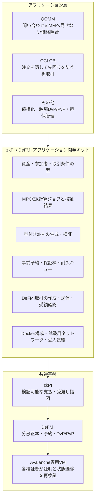

# zkPI / DeFMI アプリケーション開発キット

## 位置付け

この研究・実装の中心をQOMMという一つの市場方式に置かず、次の三層として整理する。

1. **zkPI**：アプリケーションが決めた結果と、その結果を実行してよい根拠を、秘密を必要以上に開示せず一回限りの決済指図へまとめる。
2. **DeFMI**：資産、保証枠、予約、一回限りの番号、受渡し・返金請求権を正本状態として持ち、検証済みzkPIを原子的に決済する分散型金融市場基盤。
3. **アプリケーション開発キット**：価格計算、注文照合、与信、債権化などの業務ロジックを、zkPIの生成とDeFMIの状態更新へ安全に接続する共通部品。

QOMMとOCLOBは、この開発キットを使うリファレンスアプリケーションとして扱う。QOMM固有のRFQ、RFM、RFSは重要な研究対象だが、zkPIやDeFMIをQOMM専用の内部部品にはしない。

## リファレンスアプリケーション

### QOMM

QOMMは、利用者の問い合わせとマーケットメーカーの価格規則・在庫をMPC内で照合する。利用者とマーケットメーカーは結果を見る前に取引条件と最大予約量を承認するため、価格確認後の追加署名を置かずにzkPIを発行し、DeFMIで自動決済できる。

このアプリケーションで検証する共通機能は、秘密入力、状態付き価格規則、参加可能者の非省略、勝者の最良性、指値、事前予約、同時依頼の順序、保証枠の競合、追加署名なしのDvPである。

### OCLOB

OCLOBは、公開板へ平文注文を先に出さず、注文をMPCノードへ秘密分散して価格・時間優先の照合を行う。注文の存在、価格、数量を照合前に運営者や検証者へ見せないことを第一段階とする。約定後は、照合規則、受付順、両注文の事前承認、資産予約をzkPIへ結び、DeFMIで決済する。

板は「約定前の全注文を平文公開する場所」ではなく、公開してよい集約値、コミット済み状態、成立結果を投影する表示になる。どの情報をいつ公開すれば指値決定に必要な価格発見を保ちつつ先回りを抑えられるかは、QOMMとは別の評価課題である。

OCLOBは現時点では実装予定の第二リファレンスアプリケーションであり、実装済みとは記載しない。QOMMを開発キットへ移した後、OCLOBをアプリケーション固有コードだけで構築できることを、開発キットの十分性を示す受入条件にする。

### その他の用途

Aethelの支払ストリーム債権化、異なる地域のDeFMI間のDvP/PvP、国債担保と資金供給枠なども同じ境界へ接続できる。ただし、これらをQOMMやOCLOBと同じ市場方式として扱わない。共通化するのは、資産と参加者の型、証明済み判断、事前予約、一回限りの実行、原子的決済、再送と監査の仕組みである。

## 開発キットが提供する境界

開発キットは、任意の業務プログラムを自動的に安全にするものではない。アプリケーションが次を明示し、検証可能にするための境界を提供する。

- どの資産と参加者を扱うか。
- 何を秘密入力、公開入力、当事者だけの出力、全体公開値にするか。
- どの規則をMPCまたはZKで計算し、どの検証結果をzkPIへ結ぶか。
- Maker、Taker、注文者、流動性提供者などが、どの範囲をいつ事前承認するか。
- 最悪時に必要な資産または保証枠を、どのDeFMI予約で確保するか。
- 同時要求をどの受付順と状態の版で直列化するか。
- 成功、拒否、期限切れ、計算ノード停止、再送をどう状態遷移させるか。
- DeFMI確定前にアプリケーション表示を「決済済み」にしないこと。

初期版では、既存のRust crateを次の公開境界へ整理する。

| 境界 | 現在の主な実装 | 開発キットとして必要な整理 |
|---|---|---|
| 型付き指図 | `zkpi` | アプリケーション固有文脈を拡張しても基本指図の検証条件を弱めない拡張点 |
| DeFMI状態機械 | `defmi` | 資産、予約、保証枠、DvP/PvP、請求権をアプリケーション非依存APIとして公開 |
| MPC・共同証明 | `qomm-mpc`, `qomm-proofs`, `qomm-transport` | 計算回路、公開文、ノード別証明ジョブ、完了受領を一つのジョブ定義へ束縛 |
| 業務規則 | `qomm-dsl` | 許可入力、状態、出力、範囲、状態更新をスキーマ付きで定義 |
| Avalanche接続 | `qomm-avalanche-vm` | zkPI検証設定、取引符号化、状態根、受領証を共通クライアントから利用可能にする |
| 法人参加 | `qomm-demo`内の参加モジュール | 鍵、KYB、予約、耐久キュー、再送、残高投影を独立パッケージ化 |
| 受入環境 | `demo-network` | アプリケーションを差し替えても同じ7 MPC・5 DeFMI検証者で試験できる構成 |

別言語向けの薄いクライアントを将来追加する余地は残すが、正規化、署名文、証明検証、状態遷移の基準実装はRustとする。JavaScriptはデモ表示に限定し、ブラウザで決済判断や残高計算を行わない。

## 論文としての主張

SDKを作ったこと自体や、既存のMPC、ZK、FROST、Avalancheを呼び出したこと自体は新規性としない。研究上の候補は次である。

1. **型付き合成可能性**：アプリケーションの秘密計算結果、事前承認、予約、公開検証文、zkPI、DeFMI状態遷移が、別の取引や別の状態根へ差し替えられない共通の型と安全性条件。
2. **内容を漏らさない監査**：問い合わせや注文の存在を公開せず、参加者の省略、古い状態、二重署名、選択的停止を検出する仕組み。
3. **事前拘束と自動決済**：結果確認後の拒否による探りを防ぎつつ、価格・数量・期限・保証枠の範囲外では決済できない共通予約方式。
4. **アプリケーション間の再利用可能性**：RFQ系のQOMMと価格・時間優先のOCLOBという異なる市場方式を、同じzkPI / DeFMI境界で実装し、安全性と性能を比較すること。
5. **実装に基づく限界の提示**：どの部分が共通化でき、どの部分は市場方式固有の回路、公開規則、経済評価として残るかを測定で示すこと。

QOMMの情報漏洩、マーケットメーカー損益、DP公開は、QOMMリファレンス実装に対する主要な経済研究として残す。OCLOBでは、平文板、暗号化メモリプール、バッチ方式、TEE方式などと、先回り成功率、約定品質、待ち時間、処理能力を別に比較する。二つの評価を一つの数字へ混ぜない。

## 実装順と受入条件

1. **共通境界の固定**：現在のQOMM実行経路から、資産、参加者、予約、証明ジョブ、zkPI、DeFMI取引、受領証のアプリケーション非依存部分を切り出す。
2. **QOMMの移行**：QOMMが開発キットの公開APIだけを使って、7ノードMPCから追加署名なしのDeFMI決済まで同じ受入試験を通ることを確認する。
3. **OCLOBの実装**：秘密注文、決定的な受付順、価格・時間優先、部分約定、取消期限、同時注文の枠競合、zkPI生成、DeFMI決済を実装する。
4. **第二アプリによる境界監査**：OCLOBのために共通層へ市場固有の例外を追加していないことを監査する。必要ならAPIを狭めて再設計する。
5. **再現可能な配布**：Rust crate、スキーマ、最小アプリ雛形、Docker Compose、テストベクトル、失敗例、性能測定手順を公開する。

「開発キット完成」は、型だけを公開した時点ではない。QOMMとOCLOBの双方が同じ公開境界を使い、秘密入力をログへ出さず、無効な証明や古い状態を拒否し、MPC停止時の耐久キューから復旧し、DeFMI受領証まで実ネットワーク試験で確認できた時点とする。
